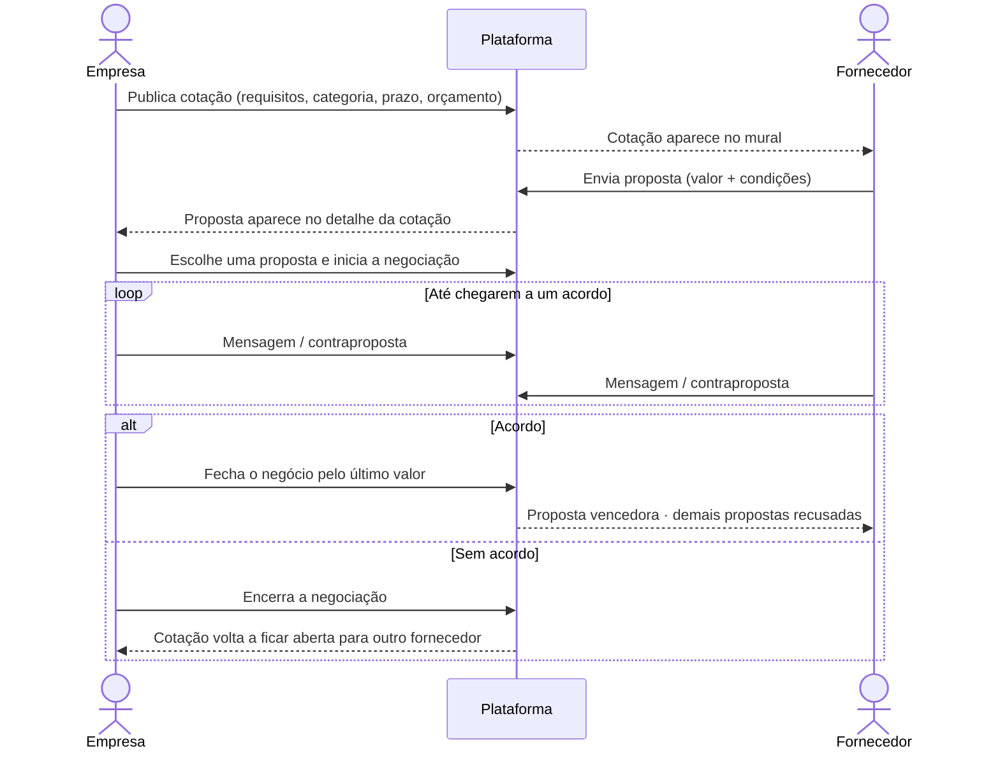
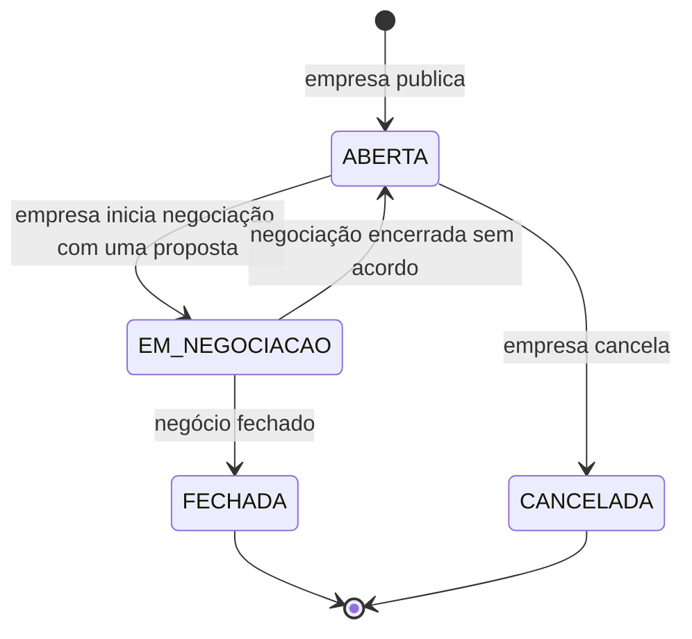
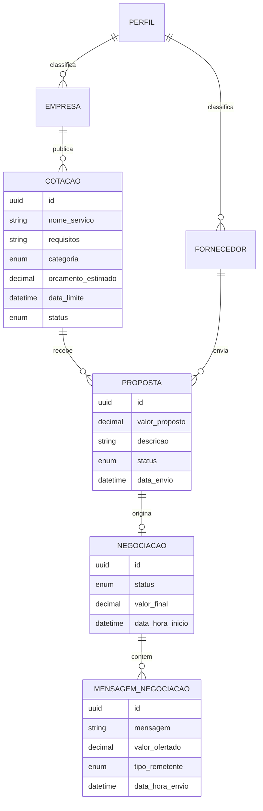

<div align="center">
  
</div>

<h3 align="center">🏆 1º lugar · 24 horas · equipe Javangers</h3>

<p align="center">
  
  
  
  
  
  
</p>

<p align="center">
  <a href="https://github.com/marcusrdrigues/hackathon-coti-criare-2025/actions/workflows/ci.yml"></a>
</p>

---

## 📑 Sumário

- [O desafio](#-o-desafio)
- [A solução](#-a-solução)
- [Funcionalidades](#-funcionalidades)
- [Regras de negócio](#-regras-de-negócio)
- [Arquitetura](#️-arquitetura)
- [Como rodar](#️-como-rodar)
- [Dados de demonstração](#-dados-de-demonstração)
- [API REST](#-api-rest)
- [Testes e CI](#-testes-e-ci)
- [Decisões técnicas](#-decisões-técnicas)
- [Limitações e próximos passos](#-limitações-e-próximos-passos)
- [Equipe](#-equipe-javangers)

---

## 🎯 O desafio

Em dezembro de 2025, a **Coti Informática** e a **Criare Sistemas** propuseram um hackathon de 24 horas de desenvolvimento contínuo. Nossa equipe de três pessoas construiu a solução vencedora: uma **plataforma de cotações e negociação entre empresas e fornecedores**.

A ideia é tirar a cotação de compras do e-mail e da planilha: a empresa publica o que precisa comprar, fornecedores disputam com propostas e as duas partes negociam o valor final dentro da própria plataforma, com todo o histórico registrado.

## 🧩 A solução



| Fluxo | Como funciona |
|---|---|
| **Perfis** | Empresa e fornecedor se cadastram com CNPJ e entram com e-mail e senha. Cada perfil tem o seu próprio painel e só acessa as próprias telas |
| **Cotações** | A empresa publica o que precisa comprar, com categoria, prazo e orçamento opcional, e acompanha o status de cada uma |
| **Propostas** | Fornecedores encontram as cotações no mural e enviam propostas; a empresa vê todas, com a melhor oferta destacada |
| **Negociação** | Empresa e fornecedor trocam mensagens e contrapropostas numa linha do tempo até fechar o negócio ou encerrar sem acordo |

---

## ✨ Funcionalidades

### 🏢 Empresa

| Tela | O que faz |
|---|---|
| **Visão geral** | Cotações abertas, propostas recebidas, negociações em andamento e negócios fechados; gráfico de demandas por categoria e ranking dos fornecedores que mais enviaram propostas |
| **Nova cotação / Editar** | Título, categoria, requisitos, data limite e orçamento estimado (opcional). Só cotações abertas podem ser editadas |
| **Minhas cotações** | Lista com filtro por status (abertas, em negociação, fechadas, canceladas), quantidade de propostas e melhor oferta |
| **Detalhe da cotação** | Requisitos, todas as propostas recebidas com CNPJ e condições, e as ações: **negociar**, **recusar** proposta e **cancelar** cotação |
| **Negociação** | Linha do tempo com a proposta inicial e cada contraproposta; botões para **fechar o negócio** pelo último valor ou **encerrar sem acordo** |

### 🚚 Fornecedor

| Tela | O que faz |
|---|---|
| **Painel** | Oportunidades abertas, propostas aguardando análise, negociações ativas, cotações ganhas e valor total fechado; últimas cotações publicadas |
| **Mural de cotações** | Cotações abertas e dentro do prazo, com busca por texto, filtro por categoria, selo "NOVO" e alerta de prazo curto; envio da proposta direto no card |
| **Propostas em andamento** | Propostas aguardando análise e negociações ativas (com atalho para responder). Propostas ainda não analisadas podem ser retiradas |
| **Histórico** | Propostas vencidas e perdidas, com o motivo (fechou com outro fornecedor, cotação cancelada, negociação sem acordo…) e total em negócios fechados |
| **Negociação** | Mesma sala da empresa: envia mensagens, contrapropostas e pode **aceitar** a última oferta da empresa |

### 🔧 Em todas as telas

- Sessão salva no navegador (sobrevive ao F5) e *guards* de rota por perfil
- Avisos visuais (*toasts*) de sucesso e erro, com as mensagens que vêm da API
- Moeda e datas no formato brasileiro (`R$ 1.234,56`, `31/12/2025`)
- Máscara de CNPJ no cadastro
- Sala de negociação atualiza sozinha a cada 10 segundos
- Telas carregadas sob demanda (*lazy loading*)

---

## 📐 Regras de negócio

### Ciclo de vida da cotação



### Regras aplicadas pela API

| Área | Regra |
|---|---|
| **Cadastro** | CNPJ validado pelos dígitos verificadores e gravado só com números (aceita com ou sem máscara) |
| | E-mail único em toda a plataforma (não pode existir como empresa e como fornecedor ao mesmo tempo) |
| | Senha gravada com hash **BCrypt**, nunca em texto puro |
| **Cotação** | Data limite precisa ser futura. Sem categoria informada, entra como "Outros" |
| | O mural só mostra cotações **abertas e dentro do prazo** |
| | Só pode ser editada enquanto está aberta; cotação com propostas não pode ser excluída, só cancelada |
| | Ao cancelar, as propostas pendentes passam para recusadas |
| **Proposta** | Só para cotações abertas e dentro do prazo |
| | Um fornecedor envia **uma** proposta por cotação |
| | Pode ser editada ou retirada enquanto não foi aceita |
| **Negociação** | Iniciar a negociação aceita a proposta e coloca a cotação em `EM_NEGOCIACAO` |
| | Apenas **uma** negociação por vez em cada cotação |
| | A proposta original vira a primeira mensagem do histórico |
| | Cada mensagem pode trazer texto, uma nova oferta de valor, ou os dois |
| | Só a empresa e o fornecedor daquela negociação podem enviar mensagens |
| | **Fechar**: grava o valor final, fecha a cotação e recusa as demais propostas pendentes |
| | **Encerrar sem acordo**: recusa a proposta e reabre a cotação para outra negociação |

---

## 🏗️ Arquitetura

```text
hackathon-coti-criare-2025/
├── .github/workflows/ci.yml     Build, testes e teste de fumaça a cada push
│
├── backend/                     API REST · Spring Boot 4 · Java 21
│   ├── docker-compose.yml       PostgreSQL 16 + API
│   ├── scripts/
│   │   └── smoke-test-api.sh    Percorre o fluxo completo via HTTP
│   └── src/main/java/com/gestao/
│       ├── configurations/      CORS, Swagger, BCrypt, perfis iniciais, dados de demonstração
│       ├── controllers/         Endpoints REST (/api/v1/...)
│       ├── dtos/                Records de entrada e saída, com Bean Validation
│       ├── entities/            Entidades JPA
│       ├── enums/               Status e categorias
│       ├── exceptions/          Exceções de negócio + GlobalExceptionHandler
│       ├── mappers/             Entidade ⇄ DTO
│       ├── repositories/        Spring Data JPA (+ projeções para o dashboard)
│       ├── services/            Regras de negócio, com @Transactional
│       └── utils/               Validação de CNPJ e normalização de e-mail
│
└── frontend/                    SPA · Angular 21 · Bootstrap 5
    └── src/app/
        ├── core/
        │   ├── api.config.ts    URL da API
        │   ├── auth.guards.ts   Guards por perfil
        │   ├── models.ts        Tipos espelhando os DTOs da API
        │   ├── services/        Um service por recurso da API + sessão + avisos
        │   └── utils/           Máscara de CNPJ, status, mensagens de erro
        └── components/
            ├── pages/           Uma pasta por tela
            └── shared/          Navbar e avisos (toasts)
```

### Modelo de dados



---

## ▶️ Como rodar

### Pré-requisitos

| Ferramenta | Versão |
|---|---|
| Java (JDK) | 21 |
| Node.js | 22 ou superior |
| Docker | qualquer versão recente (para o PostgreSQL) |

O Maven não precisa estar instalado: o projeto usa o *wrapper* (`mvnw` / `mvnw.cmd`).

### 1. Banco de dados

```bash
cd backend
docker compose up -d postgres      # PostgreSQL 16 na porta 5435
```

### 2. Back-end

```bash
cd backend

# Com dados de demonstração (recomendado para conhecer o sistema)
./mvnw spring-boot:run -Dspring-boot.run.profiles=demo

# Ou com o banco vazio
./mvnw spring-boot:run
```

> No Windows (PowerShell/CMD) use `mvnw.cmd` no lugar de `./mvnw`.

A API sobe em **http://localhost:8085**:

- Swagger UI: http://localhost:8085/swagger-ui.html
- OpenAPI (JSON): http://localhost:8085/api-docs

### 3. Front-end

```bash
cd frontend
npm install
npm start                          # ng serve
```

Acesse **http://localhost:4200**.

### Alternativa: API + banco com Docker

```bash
cd backend
SPRING_PROFILES_ACTIVE=demo docker compose up -d --build
```

> No PowerShell: `$env:SPRING_PROFILES_ACTIVE="demo"; docker compose up -d --build`

Depois é só rodar o front-end como no passo 3.

### Variáveis de ambiente do back-end

| Variável | Padrão | Para que serve |
|---|---|---|
| `SERVER_PORT` | `8085` | Porta da API |
| `SPRING_DATASOURCE_URL` | `jdbc:postgresql://localhost:5435/bdgestao` | Conexão com o banco |
| `SPRING_DATASOURCE_USERNAME` | `user` | Usuário do banco |
| `SPRING_DATASOURCE_PASSWORD` | `coti` | Senha do banco |
| `CORS_ALLOWED_ORIGINS` | `http://localhost:4200,http://127.0.0.1:4200` | Endereços do front-end liberados (separados por vírgula) |
| `SHOW_SQL` | `false` | `true` mostra o SQL gerado pelo Hibernate no console |
| `SPRING_PROFILES_ACTIVE` | — | `demo` carrega os dados de exemplo |

Se a API rodar em outra porta ou servidor, ajuste a URL em `frontend/src/app/core/api.config.ts`.

> ⚠️ **Já tinha o banco da versão do hackathon?** O esquema mudou (novas colunas e a data das mensagens passou a guardar a hora). Recrie o banco antes de subir esta versão: `docker compose down -v && docker compose up -d postgres`.

---

## 🎬 Dados de demonstração

Com o profile `demo`, a API cria (só se o banco estiver vazio):

| Perfil | E-mail | Senha |
|---|---|---|
| Empresa — Criare Consulting | `empresa@demo.com` | `demo123` |
| Fornecedor — Tech Soluções Ltda | `fornecedor@demo.com` | `demo123` |
| Fornecedor — InfoWorld Distribuidora | `infoworld@demo.com` | `demo123` |
| Fornecedor — Limpa Bem Serviços | `limpabem@demo.com` | `demo123` |

Também cria três cotações (notebooks, limpeza pós-obra e cadeiras), três propostas e uma **negociação em andamento** entre a Criare e a Tech Soluções.

**Roteiro sugerido:** abra duas janelas (uma anônima), entre como `empresa@demo.com` numa e `fornecedor@demo.com` na outra, e negociem os notebooks. A sala de negociação se atualiza sozinha.

Para cadastrar contas novas, use CNPJs válidos, por exemplo `33.445.566/0001-86`.

---

## 🔌 API REST

Todos os endpoints ficam sob `/api/v1`. A documentação completa, com exemplos, está no Swagger.

<details>
<summary><b>Autenticação e dashboard</b></summary>

| Método | Endpoint | Descrição |
|---|---|---|
| `POST` | `/auth/login` | Login; retorna `id`, `nome`, `email`, `cnpj` e `tipo` (`EMPRESA` ou `FORNECEDOR`) |
| `GET` | `/dashboard/empresa/{empresaId}` | Indicadores da empresa, demandas por categoria e top fornecedores |
| `GET` | `/dashboard/fornecedor/{fornecedorId}` | Indicadores do fornecedor e valor total fechado |

</details>

<details>
<summary><b>Empresas, fornecedores e perfis</b></summary>

| Método | Endpoint | Descrição |
|---|---|---|
| `POST` | `/empresas` | Cadastra empresa |
| `GET` | `/empresas` · `/empresas/{id}` · `/empresas/email/{email}` | Consultas |
| `PUT` | `/empresas/{id}` | Atualiza a razão social |
| `DELETE` | `/empresas/{id}` | Remove |
| `POST` | `/fornecedores` | Cadastra fornecedor |
| `GET` | `/fornecedores` · `/fornecedores/{id}` · `/fornecedores/email/{email}` | Consultas |
| `PUT` | `/fornecedores/{id}` | Atualiza o nome |
| `DELETE` | `/fornecedores/{id}` | Remove |
| `GET` | `/perfis` · `/perfis/{id}` · `/perfis/nome/{nome}` | Perfis (`EMPRESA` e `FORNECEDOR`) |

</details>

<details>
<summary><b>Cotações</b></summary>

| Método | Endpoint | Descrição |
|---|---|---|
| `POST` | `/cotacoes` | Cria cotação |
| `GET` | `/cotacoes` | Lista todas |
| `GET` | `/cotacoes/abertas` | Abertas e dentro do prazo (mural) |
| `GET` | `/cotacoes/categorias` | Categorias disponíveis |
| `GET` | `/cotacoes/{id}` | Detalhe, com quantidade de propostas e melhor oferta |
| `GET` | `/cotacoes/empresa/{empresaId}` | Cotações de uma empresa |
| `PUT` | `/cotacoes/{id}` | Edita (somente abertas) |
| `PATCH` | `/cotacoes/{id}/cancelar` | Cancela |
| `DELETE` | `/cotacoes/{id}` | Exclui (somente sem propostas) |

</details>

<details>
<summary><b>Propostas</b></summary>

| Método | Endpoint | Descrição |
|---|---|---|
| `POST` | `/propostas` | Envia proposta |
| `GET` | `/propostas/{id}` | Detalhe |
| `GET` | `/propostas/cotacao/{cotacaoId}` | Propostas de uma cotação (menor valor primeiro) |
| `GET` | `/propostas/cotacao/{cotacaoId}/count` | Quantidade de propostas |
| `GET` | `/propostas/fornecedor/{fornecedorId}` | Propostas de um fornecedor |
| `GET` | `/propostas/status/{status}` | Por status |
| `PUT` | `/propostas/{id}` | Edita (somente o dono, enquanto não analisada) |
| `PATCH` | `/propostas/{id}/aceitar` | Aceita |
| `PATCH` | `/propostas/{id}/recusar` | Recusa |
| `PATCH` | `/propostas/{id}/status` | Marca como `EM_ANALISE` |
| `DELETE` | `/propostas/{id}` | Retira (enquanto não aceita) |

</details>

<details>
<summary><b>Negociações e mensagens</b></summary>

| Método | Endpoint | Descrição |
|---|---|---|
| `POST` | `/negociacoes` | Abre negociação a partir de uma proposta (`{ "propostaId": "..." }`) |
| `GET` | `/negociacoes` · `/negociacoes/{id}` | Consultas (inclui `ultimaOferta`) |
| `GET` | `/negociacoes/proposta/{propostaId}` | Negociação de uma proposta |
| `GET` | `/negociacoes/empresa/{empresaId}` · `/negociacoes/fornecedor/{fornecedorId}` | Por participante |
| `GET` | `/negociacoes/status/{status}` | Por status |
| `PATCH` | `/negociacoes/{id}/finalizar` | Fecha o negócio (`{ "valorFinal": 1350.00 }`) |
| `PATCH` | `/negociacoes/{id}/cancelar` | Encerra sem acordo |
| `POST` | `/mensagens` | Envia mensagem e/ou contraproposta |
| `GET` | `/mensagens/negociacao/{negociacaoId}` | Histórico em ordem cronológica |
| `GET` | `/mensagens/{id}` · `DELETE /mensagens/{id}` | Consulta e remoção |

</details>

### Formato dos erros

```json
{ "status": 400, "message": "Você já enviou uma proposta para esta cotação!", "timestamp": "2025-12-20T14:30:00" }
```

Erros de validação trazem também o campo de cada problema:

```json
{
  "status": 400,
  "message": "Erro de validação nos campos",
  "timestamp": "2025-12-20T14:30:00",
  "errors": { "email": "Email inválido", "senha": "Senha deve ter entre 6 e 72 caracteres" }
}
```

| Status | Quando |
|---|---|
| `400` | Dados inválidos ou regra de negócio violada |
| `401` | E-mail ou senha inválidos |
| `404` | Registro ou endpoint inexistente |
| `409` | E-mail ou CNPJ já cadastrado |
| `500` | Erro inesperado (detalhes só no log do servidor) |

---

## 🧪 Testes e CI

```bash
# Back-end: testes unitários e de integração (H2 em memória, não precisa do PostgreSQL)
cd backend && ./mvnw verify

# Front-end: testes unitários (Vitest)
cd frontend && npm test -- --watch=false

# Teste de fumaça: com a API rodando no profile demo, percorre o fluxo via HTTP
cd backend && ./scripts/smoke-test-api.sh      # requer curl e jq
```

| Suíte | O que cobre |
|---|---|
| `FluxoCotacaoIntegrationTest` | Cadastro, login, CNPJ inválido, e-mail duplicado, proposta duplicada, negociação, contrapropostas, remetente intruso, fechamento, cancelamento, prazo vencido e dashboards |
| `DocumentosTest` | Validação de CNPJ e normalização de dados |
| `smoke-test-api.sh` | Login, CORS, validações, cotação → proposta → negociação → mensagens → fechamento e dashboards, tudo via HTTP contra o PostgreSQL |
| Front-end | Guards por perfil, máscara de CNPJ e componente raiz |

O **GitHub Actions** (`.github/workflows/ci.yml`) roda a cada push: compila e testa o back-end, sobe a API com PostgreSQL e executa o teste de fumaça, e faz o build de produção e os testes do front-end.

---

## 💡 Decisões técnicas

- **Monorepo** com back-end e front-end, unificado a partir dos repositórios originais com o histórico preservado.
- **Camadas bem separadas no back-end** (controller → service → repository) com **DTOs em `record`**: a API nunca expõe entidades JPA nem a senha.
- **Regras de negócio nos services com `@Transactional`**: operações que mexem em várias entidades (fechar negócio = negociação + cotação + outras propostas) são gravadas juntas ou não são gravadas.
- **Status por `enum`** no lugar de texto livre, para que transições inválidas sejam barradas no código.
- **Validação em duas camadas**: Bean Validation nos DTOs para formato, e services para regras que dependem do banco (duplicidade, prazo, status).
- **Tratamento global de erros** (`@RestControllerAdvice`), devolvendo sempre o mesmo formato JSON que o front-end exibe.
- **BCrypt sem a cadeia completa do Spring Security**: só o módulo de criptografia, o suficiente para o escopo atual.
- **Front-end com signals e componentes standalone**, controle de fluxo `@if`/`@for` e um service por recurso da API.
- **Tema visual centralizado** sobrescrevendo as variáveis do Bootstrap, em vez de repetir as cores da marca em cada componente.

---

## 🧭 Limitações e próximos passos

Este projeto nasceu num hackathon de 24 horas. Alguns pontos ficaram fora do escopo e são os próximos passos naturais:

- **Autenticação com token (JWT + Spring Security).** Hoje o login valida as credenciais e o front-end guarda o usuário, mas a API não exige token nos endpoints: quem conhecer os IDs consegue chamar a API diretamente. Para produção, cada requisição precisa ser autenticada e o perfil checado no back-end.
- **Notificações em tempo real** (WebSocket/SSE) no lugar da atualização periódica da sala de negociação.
- **Migrações de banco com Flyway**, no lugar do `ddl-auto=update`.
- **Paginação** nas listagens.
- **Recuperação de senha** e confirmação de e-mail.
- **Anexos** nas cotações e propostas (especificações, catálogos).

---

## 👥 Equipe Javangers

**Marcus Rodrigues** · **Gercinildo Santos** · **Carlos Ferreira**

<p align="center">
  Repositório unificado a partir dos repositórios originais do back-end e do front-end, com o <b>histórico de commits preservado</b>.<br/>
  <a href="https://github.com/marcusrdrigues">← Voltar ao perfil</a>
</p>

<div align="center">
  
</div>
