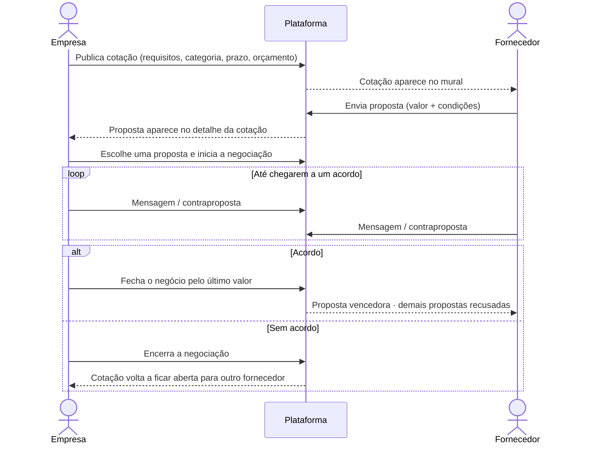
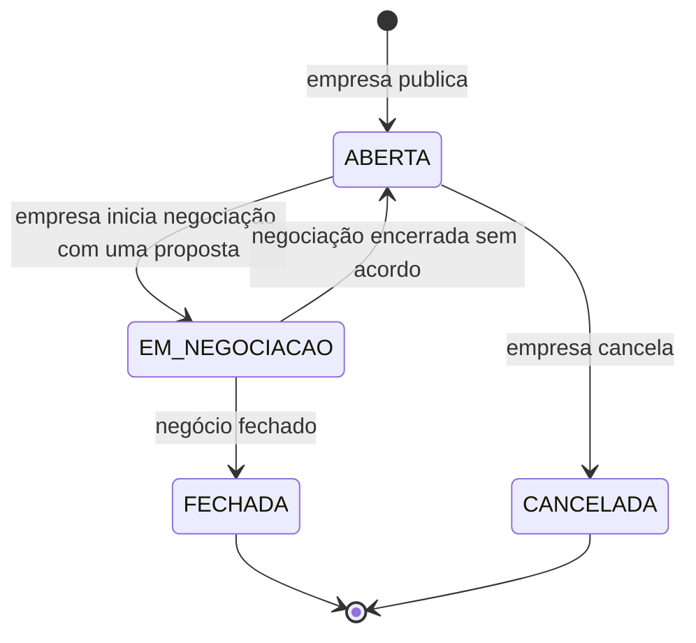
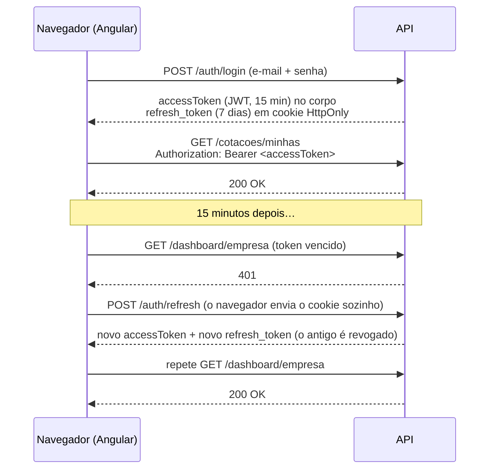
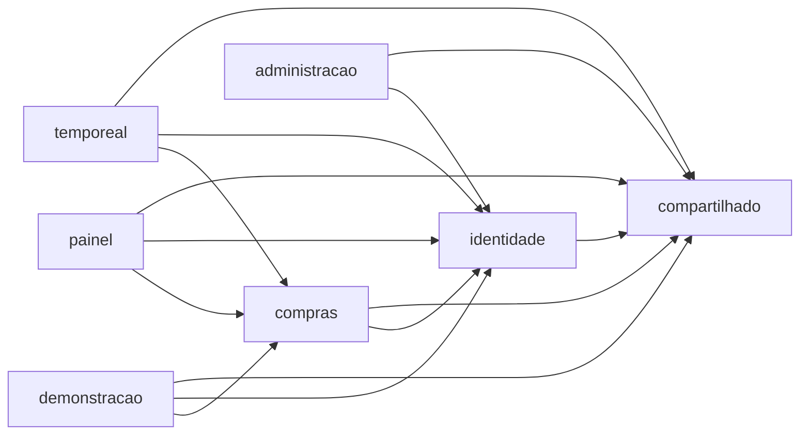
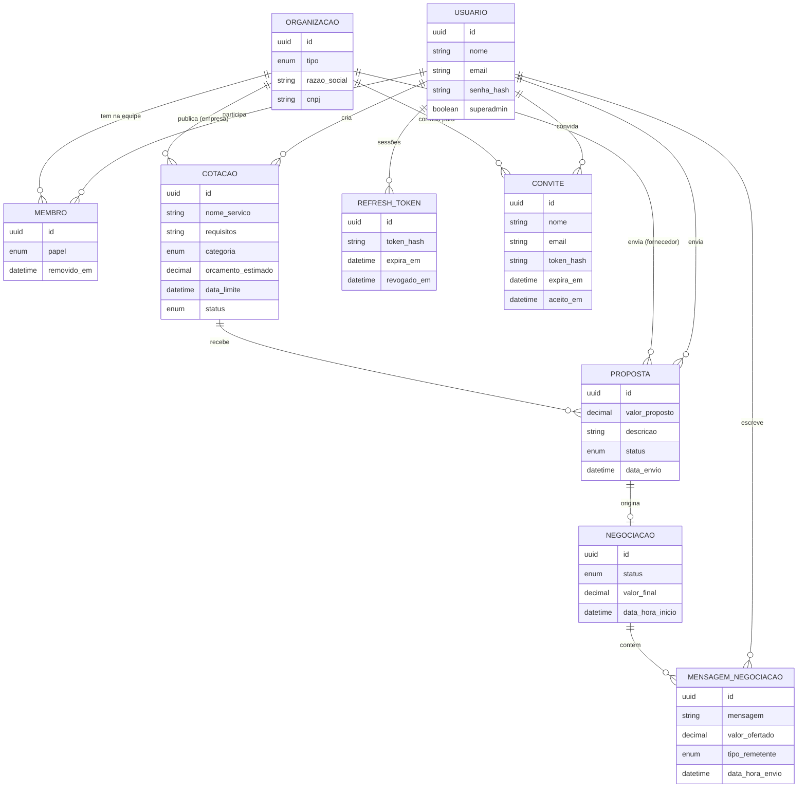

<div align="center">
  
</div>

<h3 align="center">🏆 1º lugar · 24 horas · equipe Javangers</h3>

<p align="center">
  
  
  
  
  
</p>

<p align="center">
  <a href="https://portal-criare.vercel.app"><b>Testar a demo</b></a> ·
  <a href="https://portal-criare-api.onrender.com/swagger-ui.html">Documentação da API</a>
</p>

<p align="center">
  <a href="https://github.com/marcusrdrigues/hackathon-coti-criare-2025/actions/workflows/ci.yml"></a>
  <a href="https://github.com/marcusrdrigues/hackathon-coti-criare-2025/actions/workflows/codeql.yml"></a>
  <a href="https://sonarcloud.io/summary/new_code?id=marcusrdrigues_hackathon-coti-criare-2025"></a>
  <a href="https://sonarcloud.io/summary/new_code?id=marcusrdrigues_hackathon-coti-criare-2025"></a>
</p>

---

## 📑 Sumário

- [O desafio](#-o-desafio)
- [A solução](#-a-solução)
- [Funcionalidades](#-funcionalidades)
- [Regras de negócio](#-regras-de-negócio)
- [Segurança](#-segurança)
- [Arquitetura](#️-arquitetura)
- [Como rodar](#️-como-rodar)
- [Dados de demonstração](#-dados-de-demonstração)
- [Deploy](#️-deploy)
- [API REST](#-api-rest)
- [Testes e CI](#-testes-e-ci)
- [Decisões técnicas](#-decisões-técnicas)
- [Roadmap](#️-roadmap)
- [Equipe](#-equipe-javangers)

---

## 🎯 O desafio

Em dezembro de 2025, a **Coti Informática** e a **Criare Sistemas** propuseram um hackathon de 24 horas de desenvolvimento contínuo. Nossa equipe de três pessoas construiu a solução vencedora: uma **plataforma de cotações e negociação entre empresas e fornecedores**.

A ideia é tirar a cotação de compras do e-mail e da planilha: a empresa publica o que precisa comprar, fornecedores disputam com propostas e as duas partes negociam o valor final dentro da própria plataforma, com todo o histórico registrado.

## 🧩 A solução



| Fluxo | Como funciona |
|---|---|
| **Organizações e pessoas** | Empresa e fornecedor se cadastram com CNPJ; quem faz o cadastro vira a pessoa proprietária. Cada pessoa entra com o próprio e-mail e senha e age em nome da organização, com o painel e as telas do tipo dela. Cotações, propostas e mensagens registram quem as fez |
| **Cotações** | A empresa publica o que precisa comprar, com categoria, prazo e orçamento opcional, e acompanha o status de cada uma |
| **Propostas** | Fornecedores encontram as cotações no mural e enviam propostas; a empresa vê todas, com a melhor oferta destacada |
| **Negociação** | Empresa e fornecedor trocam mensagens e ofertas numa conversa até fechar o negócio ou encerrar sem acordo. A oferta na mesa fica fixa acima do campo de mensagem, com a decisão de cada lado ("Fazer contraproposta", "Fechar por R$ …"); uma oferta nova abre num cartão próprio, que compara o valor com o da mesa e cujo botão diz o valor ("Enviar oferta de R$ …") |

---

## ✨ Funcionalidades

### 🏢 Empresa

| Tela | O que faz |
|---|---|
| **Início** | Números do momento (cotações abertas, propostas recebidas, em negociação, negócios fechados) e a lista **"Precisa da sua atenção"**: negociações em andamento, propostas esperando análise e prazos terminando; demandas por categoria e fornecedores mais ativos |
| **Nova cotação / Editar** | Título, categoria, requisitos, prazo e orçamento estimado (opcional). Só cotações abertas podem ser editadas |
| **Cotações** | Lista com filtro por situação (com contagem), busca, quantidade de propostas e menor oferta |
| **Detalhe da cotação** | Requisitos e as propostas **da menor para a maior**, com destaque para o menor valor; ações de **negociar**, **recusar** e **cancelar** a cotação, sempre com confirmação |
| **Negociações** | Todas as conversas com fornecedores, em andamento primeiro |
| **Sala de negociação** | Conversa no estilo de mensagens, com cada oferta destacada; a evolução do valor no topo (proposta inicial → última oferta); a **oferta na mesa** fixa acima do campo de mensagem, com **fazer contraproposta** e **fechar por R$ …**; uma oferta nova abre num cartão que compara o valor com o da mesa. **Encerrar sem acordo** fica nos detalhes e no menu "Mais ações", sempre com confirmação |

### 🚚 Fornecedor

| Tela | O que faz |
|---|---|
| **Início** | Cotações no mural, propostas aguardando, negociações ativas e total em negócios fechados; negociações que pedem resposta e as cotações mais recentes |
| **Mural** | Cotações abertas e dentro do prazo, com busca, filtro por categoria, marcação de "Novo" e aviso de prazo curto; a proposta é enviada num painel lateral |
| **Propostas · Em andamento** | Propostas aguardando análise e negociações ativas (com atalho para responder). Propostas ainda não analisadas podem ser retiradas |
| **Propostas · Histórico** | Propostas vencidas e perdidas, com o motivo (fechou com outro fornecedor, cotação cancelada, negociação sem acordo…) e total em negócios fechados |
| **Negociações** | Mesma sala da empresa: envia mensagens, faz ofertas pelo cartão de oferta e pode **aceitar R$ …** a última oferta da empresa |

### 🛡️ Superadmin

| Tela | O que faz |
|---|---|
| **Organizações** | Todas as organizações da plataforma, das mais recentes ou por nome, com o tipo, o CNPJ, a data de entrada e o uso (cotações publicadas ou propostas enviadas, e pessoas na equipe), carregadas aos poucos. Somente leitura; o superadmin não entra nas telas das organizações |

### 🔧 Em todas as telas

- Login com JWT: a sessão sobrevive ao F5 e é renovada sozinha quando o token vence; *guards* de rota por perfil
- Visual no padrão das interfaces da Apple, com **Liquid Glass** na camada que flutua: barra de abas em cápsula de vidro no celular, barra lateral de vidro encostada na borda e **recolhível** aos ícones ([ADR 0019](docs/adr/0019-barra-lateral-encostada-e-recolhivel.md)), topo de vidro, menus e painéis translúcidos, botões em cápsula. O conteúdo continua sólido, e o vidro vira superfície sólida quando o sistema pede menos transparência ou mais contraste ([ADR 0018](docs/adr/0018-liquid-glass-na-camada-flutuante.md))
- Componentes próprios (seletor, menu, controle segmentado, painel lateral, diálogo de confirmação), acessíveis pelo teclado e pelo leitor de tela
- Avisos rápidos de sucesso e erro, com as mensagens que vêm da API
- Moeda e datas no formato brasileiro (`R$ 1.234,56`, `31/12/2025`)
- Máscara de CNPJ no cadastro, que cria a organização e a pessoa proprietária juntas
- Menu da conta com a pessoa, a organização e o papel dela (proprietária ou membro)
- **Equipe**: todos veem quem faz parte da organização; a proprietária convida pelo nome e e-mail, recebe um link de uso único para copiar ou compartilhar, cancela convites e remove pessoas. Quem recebe o link define a senha e já entra trabalhando
- Na negociação, cada mensagem fica do lado da organização de quem escreveu e mostra o nome da pessoa
- Sala de negociação **ao vivo** (WebSocket): mensagens e ofertas chegam na hora, com "digitando…" e indicador de conexão; sem conexão, volta a consultar a cada 10 segundos
- **Mensagens não lidas** contadas na barra lateral, nas abas do celular e em cada negociação da lista; abrir a conversa zera o contador
- **Avisos ao vivo em qualquer tela**: mensagem nova, proposta recebida, negociação aberta, fechada ou encerrada, com atalho para abrir; as telas abertas se atualizam sozinhas
- Telas carregadas sob demanda (*lazy loading*)
- **Modo claro e escuro**: segue o tema do sistema e pode ser fixado no menu do usuário ou no canto das telas de acesso
- Layout responsivo, do celular ao monitor largo; login e cadastro cabem na tela sem rolagem

---

## 📐 Regras de negócio

### Ciclo de vida da cotação



### Regras aplicadas pela API

| Área | Regra |
|---|---|
| **Cadastro** | CNPJ validado pelos dígitos verificadores e gravado só com números (aceita com ou sem máscara) |
| | E-mail único em toda a plataforma (não pode existir como empresa e como fornecedor ao mesmo tempo) |
| | Senha gravada com hash **BCrypt**, nunca em texto puro |
| **Cotação** | Data limite precisa ser futura. Sem categoria informada, entra como "Outros" |
| | O mural só mostra cotações **abertas e dentro do prazo** |
| | Só pode ser editada enquanto está aberta; cotação com propostas não pode ser excluída, só cancelada |
| | Ao cancelar, as propostas pendentes passam para recusadas |
| **Proposta** | Só para cotações abertas e dentro do prazo |
| | Um fornecedor envia **uma** proposta por cotação |
| | Pode ser editada ou retirada enquanto não foi aceita |
| **Negociação** | Iniciar a negociação aceita a proposta e coloca a cotação em `EM_NEGOCIACAO` |
| | Apenas **uma** negociação por vez em cada cotação |
| | A proposta original vira a primeira mensagem do histórico |
| | Cada mensagem pode trazer texto, uma nova oferta de valor, ou os dois |
| | Só a empresa e o fornecedor daquela negociação podem enviar mensagens |
| | **Fechar**: grava o valor final, fecha a cotação e recusa as demais propostas pendentes |
| | **Encerrar sem acordo**: recusa a proposta e reabre a cotação para outra negociação |

---

## 🔐 Segurança

A API é **stateless** e protegida com **Spring Security + JWT**. Toda rota exige um token, exceto login, renovação de sessão, cadastro, a lista de categorias e a documentação.



| Camada | Como foi feito | Por quê |
|---|---|---|
| **Access token** | JWT assinado com HMAC-SHA256, válido por 15 minutos, contendo só identificadores: a pessoa (`sub`), a organização (`org`), o tipo dela (`EMPRESA`/`FORNECEDOR`) e o papel da pessoa (`PROPRIETARIO`/`MEMBRO`). O do superadmin leva só a pessoa e o papel `SUPERADMIN` | Vida curta limita o estrago se vazar; sem dado pessoal no token |
| **Onde o front guarda** | Access token **só em memória**; nada de token no `localStorage` | Um script malicioso (XSS) não encontra o token salvo no navegador |
| **Refresh token** | Valor aleatório de 256 bits num cookie `HttpOnly`, `SameSite=Strict`, restrito a `/api/v1/auth` | O JavaScript não lê o cookie, e ele não é enviado a partir de outros sites (CSRF) |
| **No banco** | Só o **hash SHA-256** do refresh token | Quem acessar o banco não consegue usar as sessões gravadas |
| **Rotação** | Cada renovação gera um refresh token novo e revoga o anterior | Um token roubado só serve uma vez |
| **Convites** | Link com token aleatório de 256 bits, válido por 72 horas e uma vez só; o banco guarda só o hash. O token vai depois do `#` do link e no corpo das requisições, nunca no caminho da URL | Quem acessa o banco não usa os convites, e o token não aparece em log de acesso da Vercel, da API ou de proxies |
| **Saída da equipe** | Remover uma pessoa revoga todas as sessões dela e fecha as conexões em tempo real abertas por ela | O acesso acaba na hora; o access token em uso vence em até 15 minutos |
| **Detecção de reuso** | Se um refresh token já usado aparecer de novo, **todas** as sessões daquele usuário são encerradas | Reuso indica que alguém copiou o token |
| **Força bruta** | 5 senhas erradas para o mesmo e-mail em 15 minutos bloqueiam o login (HTTP 429 com `Retry-After`) | Dificulta adivinhar senhas |
| **Senhas** | BCrypt; cadastro exige 8+ caracteres com letras e números | Hash lento e com *salt*, resistente a vazamentos |
| **Autorização por perfil** | `@PreAuthorize("hasRole('EMPRESA')")` nos endpoints | Fornecedor não cria cotação, empresa não envia proposta |
| **Autorização por organização** | Uma política de acesso única no módulo de compras (`AcessoCompras`), usada pela API e pelo WebSocket. Recurso de outra organização responde **404**, igual a um id que não existe | Empresa só vê e altera as próprias cotações; fornecedor não vê o lance do concorrente nem cotações fora do mural em que não entrou; negociação só para as duas organizações participantes. O 404 não confirma que o id existe ([ADR 0016](docs/adr/0016-autorizacao-por-organizacao.md)) |
| **Trava de rota nova** | Um teste lê todas as rotas da API que recebem id e exige, para cada uma, a tentativa de outra organização | Uma rota nova sem teste de isolamento quebra o build |
| **Superadmin** | Nasce só da configuração do servidor (`SUPERADMIN_EMAIL` e `SUPERADMIN_SENHA`, 12+ caracteres); sem ela, nenhum fica ativo. Nunca promove uma conta existente, não tem organização e só alcança `/api/v1/admin/**`, somente leitura. As demais rotas exigem o perfil de uma organização já no filtro de segurança, e o WebSocket recusa a conexão dele | Nenhuma tela ou rota cria um administrador; um token sem organização não chega aos dados de compras |
| **Identidade** | Quem é a pessoa e em nome de qual organização ela age vem **sempre do token**, nunca de um ID enviado no corpo | Ninguém consegue agir em nome de outra empresa trocando um ID |
| **Chave de assinatura** | Lida da variável `JWT_SECRET`; sem ela, a API gera uma chave aleatória e avisa no log | Nenhum segredo fica no código |
| **Rastreio** | Cada requisição tem um `traceId` (OpenTelemetry), que aparece em todas as linhas de log dela, no cabeçalho `X-Trace-Id` e no corpo dos erros. O front mostra o começo dele quando algo falha no servidor | Uma reclamação vira uma busca nos logs, sem expor detalhes do erro a quem usa |
| **Logs** | Em JSON (formato ECS) em produção; nunca registram senha, token, e-mail completo nem o conteúdo de propostas e mensagens. Um teste confere | Log é um destino a mais para dado vazar, e o sigilo comercial da negociação vale ali também |

O Swagger já vem com o botão **Authorize**: faça o login em `/api/v1/auth/login` e cole o `accessToken`.

---

## 🏗️ Arquitetura

```text
hackathon-coti-criare-2025/
├── .github/
│   ├── workflows/ci.yml         Build, testes e teste de fumaça a cada push
│   ├── workflows/codeql.yml     Análise de segurança do código (CodeQL)
│   └── dependabot.yml           Atualização semanal de dependências
├── render.yaml                  Deploy da API no Render (Blueprint)
├── docs/                        Deploy, gravação da demo e design system
│   ├── adr/                     Registros das decisões de arquitetura
│   └── specs/                   Especificações de cada fase (Spec-Driven Development)
│
├── backend/                     API REST · Spring Boot 4 · Java 21
│   ├── docker-compose.yml       PostgreSQL 16 + API
│   ├── scripts/
│   │   └── smoke-test-api.sh    Percorre o fluxo completo via HTTP
│   ├── src/main/resources/db/migration/   Esquema do banco versionado (Flyway, em SQL)
│   ├── src/main/java/db/migration/        Migração que precisa de código (V2_1)
│   └── src/main/java/com/gestao/   Um módulo por pasta, cada um com dominio · aplicacao · infraestrutura
│       ├── identidade/          Organizações, pessoas e papéis, cadastro, login, sessões (JWT + refresh token) e segurança da API
│       ├── compras/             Cotações, propostas, negociações e mensagens
│       ├── painel/              Números dos dashboards (só leitura)
│       ├── administracao/       Área do superadmin: organizações e uso (só leitura)
│       ├── temporeal/           WebSocket/STOMP: eventos de compras ao vivo
│       ├── demonstracao/        Contas e dados da demo pública
│       └── compartilhado/       Exceções de negócio, validação de CNPJ, CORS e Swagger
│
└── frontend/                    SPA · Angular 21 · CSS próprio
    ├── vercel.json              Deploy na Vercel; repassa /api/* para a API
    ├── e2e/                     Testes ponta a ponta (Playwright)
    ├── src/environments/        URL da API em desenvolvimento e em produção
    ├── src/styles/              Tokens (cores, tipografia, espaços), base e peças globais em CSS
    └── src/app/
        ├── core/
        │   ├── api.config.ts    URL da API
        │   ├── auth.guards.ts   Guards por perfil
        │   ├── auth.interceptor.ts  Envia o token e renova a sessão quando ele vence
        │   ├── models.ts        Tipos espelhando os DTOs da API
        │   ├── services/        Um service por recurso da API + sessão + avisos
        │   └── utils/           Máscara de CNPJ, status, mensagens de erro, comparação de ofertas
        ├── components/
        │   ├── pages/           Uma pasta por tela
        │   └── shared/          Estrutura (barra lateral e abas), avisos, telas de acesso, seletor de tema
        └── ui/                  Componentes globais: ícones, seletor, menu, segmentado, painel, confirmação, status
```

### Módulos e camadas

O back-end é um **monólito modular**: um único deploy, dividido em módulos de negócio com fronteiras verificadas por teste. Cada módulo segue a **Clean Architecture**, com as dependências sempre apontando para dentro ([ADR 0013](docs/adr/0013-monolito-modular-com-clean-architecture.md)).



```text
modulo/
├── dominio/          Entidades, status e eventos de domínio
├── aplicacao/        Casos de uso e mapeadores
│   ├── dto/          Entradas e saídas, com Bean Validation
│   └── porta/        Interfaces para o que é externo: persistência, token, senha, tempo real
└── infraestrutura/   Adaptadores: REST, Spring Data JPA/JDBC, segurança, STOMP
```

- **Entre módulos:** um módulo só usa o que o outro expõe (domínio, casos de uso e DTOs) e nunca os repositórios ou a infraestrutura dele. Não há dependência circular. Quem confere é o **Spring Modulith**.
- **Entre camadas:** o domínio não conhece aplicação nem infraestrutura, e a aplicação não conhece web, Spring Data nem Spring Security. Ela fala com o mundo externo por **portas**, implementadas por **adaptadores**. Quem confere é o **ArchUnit**.
- **CQRS no mesmo banco:** o módulo `painel` só lê, com consultas próprias, sem passar pelas regras de escrita.
- **Pronto para virar serviço:** como os módulos só conversam pela API uns dos outros, um deles pode ser extraído sem reescrever o resto. O primeiro candidato é a IA, se os números justificarem.

As duas verificações estão em [`ArquiteturaTest`](backend/src/test/java/com/gestao/ArquiteturaTest.java): quebrar uma regra quebra o build.

### Modelo de dados

Uma **organização** é a empresa compradora ou o fornecedor; um **usuário** é a pessoa que entra no sistema; um **membro** liga a pessoa à organização, com um papel. Os dados do negócio pertencem à organização e registram a pessoa que agiu ([ADR 0015](docs/adr/0015-pessoas-e-organizacoes-separadas.md)).



As tabelas antigas (`tb_empresa`, `tb_fornecedor` e `tb_perfil`) ficam no banco, sem uso, até a migração V5, depois da validação em produção. Antes disso, a V2_1 (escrita em Java) solta as chaves estrangeiras que apontavam para elas, porque o banco de produção nasceu do Hibernate e os nomes dessas chaves não são os do script.

---

## ▶️ Como rodar

### Pré-requisitos

| Ferramenta | Versão |
|---|---|
| Java (JDK) | 21 |
| Node.js | 22 ou superior |
| Docker | qualquer versão recente (para o PostgreSQL) |

O Maven não precisa estar instalado: o projeto usa o *wrapper* (`mvnw` / `mvnw.cmd`).

### 1. Banco de dados

```bash
cd backend
docker compose up -d postgres      # PostgreSQL 16 na porta 5435
```

### 2. Back-end

```bash
cd backend

# Com dados de demonstração (recomendado para conhecer o sistema)
./mvnw spring-boot:run -Dspring-boot.run.profiles=demo

# Ou com o banco vazio
./mvnw spring-boot:run
```

> No Windows (PowerShell/CMD) use `mvnw.cmd` no lugar de `./mvnw`.

A API sobe em **http://localhost:8085**:

- Swagger UI: http://localhost:8085/swagger-ui.html
- OpenAPI (JSON): http://localhost:8085/api-docs

### 3. Front-end

```bash
cd frontend
npm install
npm start                          # ng serve
```

Acesse **http://localhost:4200** (use `localhost`, e não `127.0.0.1`: o cookie da sessão é `SameSite=Strict` e o navegador trata os dois como sites diferentes).

### Alternativa: API + banco com Docker

```bash
cd backend
SPRING_PROFILES_ACTIVE=demo docker compose up -d --build
```

> No PowerShell: `$env:SPRING_PROFILES_ACTIVE="demo"; docker compose up -d --build`

Depois é só rodar o front-end como no passo 3.

### Variáveis de ambiente do back-end

Para rodar localmente sem exportar nada, copie [`backend/.env.example`](backend/.env.example) para `backend/.env` e preencha: a API lê esse arquivo ao subir (pelo Maven ou pelo `docker compose`), e ele fica fora do git. Variáveis de ambiente de verdade, como as do Render, têm prioridade sobre o arquivo.

| Variável | Padrão | Para que serve |
|---|---|---|
| `SERVER_PORT` | `8085` | Porta da API (também aceita `PORT`, usada por plataformas como o Render) |
| `SPRING_DATASOURCE_URL` | `jdbc:postgresql://localhost:5435/bdgestao` | Conexão com o banco |
| `SPRING_DATASOURCE_USERNAME` | `user` | Usuário do banco |
| `SPRING_DATASOURCE_PASSWORD` | `coti` | Senha do banco |
| `CORS_ALLOWED_ORIGINS` | `http://localhost:4200,http://127.0.0.1:4200` | Endereços do front-end liberados (separados por vírgula) |
| `SHOW_SQL` | `false` | `true` mostra o SQL gerado pelo Hibernate no console |
| `SPRING_PROFILES_ACTIVE` | — | `demo` carrega os dados de exemplo |
| `JWT_SECRET` | — (gera uma aleatória) | Chave de assinatura dos tokens, em Base64, com pelo menos 256 bits. Gere com `openssl rand -base64 32`. Sem ela, os tokens deixam de valer quando a API reinicia |
| `JWT_EXPIRACAO_ACESSO` | `15m` | Validade do access token |
| `JWT_EXPIRACAO_REFRESH` | `7d` | Validade do refresh token |
| `JWT_COOKIE_SECURE` | `false` | `true` em produção (HTTPS): o cookie só trafega por conexão segura |
| `DB_POOL_SIZE` | `10` | Máximo de conexões com o banco |
| `SUPERADMIN_EMAIL` e `SUPERADMIN_SENHA` | — (sem superadmin) | O superadmin da plataforma. A senha precisa de 12 caracteres ou mais. Trocar a senha atualiza a conta e encerra as sessões dela; trocar o e-mail troca o superadmin; apagar as duas desativa |
| `DEMO_RESET_CRON` | `0 0 4 * * *` | Profile `demo`: quando os dados de exemplo voltam ao estado inicial (horário de Brasília) |
| `LOGGING_STRUCTURED_FORMAT_CONSOLE` | — (texto) | `ecs` grava os logs em JSON, com o `traceId` de cada requisição (usado em produção) |
| `MANAGEMENT_OPENTELEMETRY_TRACING_EXPORT_OTLP_ENDPOINT` | — (não exporta) | Endereço de um coletor OpenTelemetry (OTLP/HTTP) para receber os traces |

Se a API rodar em outra porta ou servidor, ajuste a URL em `frontend/src/environments/environment.development.ts`.

---

## 🎬 Dados de demonstração

Com o profile `demo`, a tela de login ganha os botões **Entrar como empresa** e **Entrar como fornecedor**: dá para conhecer o sistema com um clique, sem cadastro.

A API popula o banco na primeira inicialização (se estiver vazio) e **volta os dados ao estado inicial todo dia às 4h**, para a demo pública não ficar bagunçada pelo uso dos visitantes.

| Organização | Pessoa | E-mail | Senha |
|---|---|---|---|
| Empresa — Criare Consulting | Ana Ribeiro (proprietária) | `empresa@demo.com` | `demo1234` |
| Empresa — Criare Consulting | Bruno Costa (membro) | `bruno.compras@demo.com` | `demo1234` |
| Empresa — Hospital Santa Vida | Helena Duarte (proprietária) | `hospital@demo.com` | `demo1234` |
| Fornecedor — Tech Soluções Ltda | Carlos Mendes (proprietário) | `fornecedor@demo.com` | `demo1234` |
| Fornecedor — Tech Soluções Ltda | Daniela Rocha (membro) | `daniela.vendas@demo.com` | `demo1234` |
| Fornecedor — InfoWorld Distribuidora | Eduardo Lima (proprietário) | `infoworld@demo.com` | `demo1234` |
| Fornecedor — Limpa Bem Serviços | Fernanda Alves (proprietária) | `limpabem@demo.com` | `demo1234` |
| Fornecedor — Clima Frio Ar-Condicionado | Gustavo Pires (proprietário) | `climafrio@demo.com` | `demo1234` |

Os botões de um clique entram como Ana (Criare) e Carlos (Tech). O cenário inclui cotações abertas das duas empresas, uma **negociação em andamento** (notebooks, com contraproposta da Ana e resposta da Daniela) e um **negócio já fechado** (licenças de software, negociado pelo Bruno), para os dashboards e o histórico não começarem vazios.

**Roteiro sugerido:** abra duas janelas (uma anônima), entre como empresa numa e como fornecedor na outra, e continuem a negociação dos notebooks. A sala de negociação se atualiza sozinha.

Para cadastrar organizações novas, use um CNPJ válido (por exemplo `33.445.566/0001-86`) e uma senha com 8+ caracteres, letras e números. O mesmo CNPJ pode ser cadastrado uma vez como empresa e uma vez como fornecedor.

---

## ☁️ Deploy

A demo pública está em **[portal-criare.vercel.app](https://portal-criare.vercel.app)**, montada com serviços gratuitos:

| Parte | Serviço | Configuração |
|---|---|---|
| Front-end | Vercel | [`frontend/vercel.json`](frontend/vercel.json): build do Angular e repasse de `/api/*` para a API |
| API | Render | [`render.yaml`](render.yaml): Docker, health check e `JWT_SECRET` gerado pela plataforma |
| Banco | Neon | PostgreSQL gerenciado; o Flyway cria e atualiza o esquema na inicialização |

Com o repasse da Vercel, o navegador fala só com um domínio: o cookie da sessão funciona com `SameSite=Strict` e não há chamada entre domínios. O passo a passo completo está em **[docs/deploy.md](docs/deploy.md)**.

---

## 🔌 API REST

Todos os endpoints ficam sob `/api/v1`. A documentação completa, com exemplos, está no Swagger.

Legenda: 🌐 público · 🔑 qualquer pessoa de uma organização · 🏢 só empresa · 🚚 só fornecedor · 🛡️ só o superadmin. As rotas marcadas como "dona" ou "participante" também conferem se o recurso é da organização do token; se não for, respondem `404`, como um id que não existe.

<details>
<summary><b>Autenticação e dashboard</b></summary>

| Método | Endpoint | Acesso | Descrição |
|---|---|---|---|
| `POST` | `/auth/login` | 🌐 | Devolve `accessToken`, `expiresIn` e o usuário; grava o cookie `refresh_token` |
| `POST` | `/auth/refresh` | 🌐 (cookie) | Troca o refresh token do cookie por um access token novo |
| `POST` | `/auth/logout` | 🌐 (cookie) | Revoga o refresh token e apaga o cookie |
| `GET` | `/auth/me` | 🔑 | A pessoa do token (`id`, `nome`, `email`), o `tipo` e o `papel`, e a `organizacao` (`id`, `razaoSocial`, `cnpj`). O login e a renovação devolvem o mesmo objeto em `usuario` |
| `GET` | `/dashboard/empresa` | 🏢 | Indicadores, demandas por categoria e top fornecedores |
| `GET` | `/dashboard/fornecedor` | 🚚 | Indicadores e valor total fechado |

</details>

<details>
<summary><b>Cadastro de empresas e fornecedores</b></summary>

| Método | Endpoint | Acesso | Descrição |
|---|---|---|---|
| `POST` | `/cadastro` | 🌐 | Cria a organização (`tipo`: `EMPRESA` ou `FORNECEDOR`, `razaoSocial`, `cnpj`) e a pessoa proprietária (`nome`, `email`, `senha`) juntas. Devolve `201` com o mesmo objeto de `/auth/me`; `409` para e-mail já usado ou CNPJ já cadastrado com o mesmo tipo |

</details>

<details>
<summary><b>Equipe e convites</b></summary>

| Método | Endpoint | Acesso | Descrição |
|---|---|---|---|
| `GET` | `/equipe/membros` | 🔑 | Pessoas ativas da organização, proprietários primeiro (`voce` marca quem pediu) |
| `DELETE` | `/equipe/membros/{id}` | 👑 dona | Remove da equipe: revoga as sessões e fecha o tempo real da pessoa (`204`) |
| `GET` | `/equipe/convites` | 👑 | Convites pendentes, sem o link |
| `POST` | `/equipe/convites` | 👑 | `{ nome, email }`; devolve o `token` do link, só nesta resposta (`201`) |
| `DELETE` | `/equipe/convites/{id}` | 👑 dona | Cancela o convite; o link deixa de valer (`204`) |
| `POST` | `/convites/consulta` | 🌐 | `{ token }`; de qual organização é o convite e para quem |
| `POST` | `/convites/aceite` | 🌐 | `{ token, nome, senha }`; cria a conta como membro e já abre a sessão (`201` + cookie) |

👑 só o proprietário da organização. O link que a pessoa recebe é `https://…/convite#<token>`.

</details>

<details>
<summary><b>Cotações</b></summary>

| Método | Endpoint | Acesso | Descrição |
|---|---|---|---|
| `POST` | `/cotacoes` | 🏢 | Cria cotação em nome da empresa do token |
| `GET` | `/cotacoes/minhas` | 🏢 | Cotações da empresa logada |
| `GET` | `/cotacoes/abertas` | 🔑 | Abertas e dentro do prazo (mural) |
| `GET` | `/cotacoes/categorias` | 🌐 | Categorias disponíveis |
| `GET` | `/cotacoes/{id}` | 🔑 | Detalhe; empresas veem as próprias, fornecedores as abertas e aquelas em que enviaram proposta |
| `PUT` | `/cotacoes/{id}` | 🏢 dona | Edita (somente abertas) |
| `PATCH` | `/cotacoes/{id}/cancelar` | 🏢 dona | Cancela |

</details>

<details>
<summary><b>Propostas</b></summary>

| Método | Endpoint | Acesso | Descrição |
|---|---|---|---|
| `POST` | `/propostas` | 🚚 | Envia proposta em nome do fornecedor do token |
| `GET` | `/propostas/minhas` | 🚚 | Propostas do fornecedor logado |
| `GET` | `/propostas/{id}` | 🔑 autor ou empresa da cotação | Detalhe |
| `GET` | `/propostas/cotacao/{cotacaoId}` | 🏢 dona | Propostas de uma cotação (menor valor primeiro) |
| `PATCH` | `/propostas/{id}/recusar` | 🏢 dona da cotação | Recusa |
| `DELETE` | `/propostas/{id}` | 🚚 autor | Retira, enquanto não aceita |

</details>

<details>
<summary><b>Negociações e mensagens</b></summary>

| Método | Endpoint | Acesso | Descrição |
|---|---|---|---|
| `POST` | `/negociacoes` | 🏢 dona da cotação | Aceita a proposta e abre a negociação (`{ "propostaId": "..." }`) |
| `GET` | `/negociacoes/minhas` | 🔑 | Negociações do usuário logado, com `naoLidas` (mensagens da outra parte ainda não vistas) |
| `GET` | `/negociacoes/{id}` | 🔑 participante | Detalhe, com `ultimaOferta` e `naoLidas` |
| `PATCH` | `/negociacoes/{id}/leitura` | 🔑 participante | Marca como lido tudo o que a outra parte enviou até agora (`204`) |
| `PATCH` | `/negociacoes/{id}/finalizar` | 🏢 participante | Fecha o negócio (`{ "valorFinal": 1350.00 }`) |
| `PATCH` | `/negociacoes/{id}/cancelar` | 🏢 participante | Encerra sem acordo |
| `POST` | `/mensagens` | 🔑 participante | Mensagem e/ou contraproposta; o remetente vem do token |
| `GET` | `/mensagens/negociacao/{negociacaoId}` | 🔑 participante | Histórico em ordem cronológica |

</details>

<details>
<summary><b>Administração (superadmin)</b></summary>

| Método | Endpoint | Acesso | Descrição |
|---|---|---|---|
| `GET` | `/admin/organizacoes` | 🛡️ | Organizações com o tipo, a data de entrada e os totais de pessoas ativas, cotações e propostas. Paginada: `page`, `size` (até 50) e `sort` (`razaoSocial` ou `criadaEm`, com `,asc` ou `,desc`); padrão: mais recentes |

O superadmin não tem organização: `/auth/me` devolve `papel: "SUPERADMIN"`, com `tipo` e `organizacao` nulos.

</details>

### Tempo real (WebSocket)

Conexão STOMP em `/ws` (em produção, `wss://portal-criare-api.onrender.com/ws`), autenticada no CONNECT com o mesmo token: `Authorization: Bearer <accessToken>`. Detalhes e motivos em [ADR 0012](docs/adr/0012-tempo-real-com-websocket-e-stomp.md).

| Destino | Direção | Quem pode | O que trafega |
|---|---|---|---|
| `/topic/negociacoes/{id}` | servidor → cliente | as duas partes da negociação | `MENSAGEM` (mensagem + negociação atualizada), `STATUS` (fechada ou encerrada) e `DIGITANDO` |
| `/user/queue/avisos` | servidor → cliente | o próprio usuário | mensagem nova, proposta recebida, negociação aberta, fechada ou encerrada (alimenta o contador de não lidas e os avisos na tela) |
| `/app/negociacoes/{id}/digitando` | cliente → servidor | as duas partes da negociação | sinal de "digitando", repassado à outra parte |

### Formato dos erros

```json
{
  "status": 400,
  "message": "Você já enviou uma proposta para esta cotação!",
  "timestamp": "2025-12-20T14:30:00",
  "traceId": "4bf92f3577b34da6a3ce929d0e0e4736"
}
```

O `traceId` é o mesmo do cabeçalho `X-Trace-Id` e das linhas de log daquela requisição.

Erros de validação trazem também o campo de cada problema:

```json
{
  "status": 400,
  "message": "Erro de validação nos campos",
  "timestamp": "2025-12-20T14:30:00",
  "traceId": "0af7651916cd43dd8448eb211c80319c",
  "errors": { "email": "Email inválido", "senha": "Senha deve ter letras e números" }
}
```

| Status | Quando |
|---|---|
| `400` | Dados inválidos ou regra de negócio violada |
| `401` | Sem token, token inválido/vencido, sessão expirada ou e-mail/senha errados |
| `403` | Perfil sem permissão, ou ação que a organização não pode fazer num recurso que ela enxerga (o fornecedor fechar a negociação, por exemplo) |
| `404` | Registro ou endpoint inexistente |
| `409` | E-mail ou CNPJ já cadastrado |
| `429` | Login bloqueado por excesso de tentativas (veja o header `Retry-After`) |
| `500` | Erro inesperado (detalhes só no log do servidor, achados pelo `traceId`) |

---

## 🧪 Testes e CI

```bash
# Back-end: testes unitários e de integração. Com Docker, as suítes *Postgres*
# sobem um PostgreSQL 16 real (Testcontainers); sem Docker elas são puladas e o resto roda no H2
cd backend && ./mvnw verify

# Front-end: testes unitários (Vitest)
cd frontend && npm test -- --watch=false

# Relatório de cobertura do back-end (gerado pelo verify): backend/target/site/jacoco/index.html

# Ponta a ponta (Playwright): com a API rodando no profile demo; o front-end sobe sozinho
cd frontend && npx playwright install chromium && npm run e2e

# Teste de fumaça: com a API rodando no profile demo, percorre o fluxo via HTTP
cd backend && ./scripts/smoke-test-api.sh      # requer curl e jq
```

| Suíte | O que cobre |
|---|---|
| `FluxoCotacaoIntegrationTest` | Cadastro de organização e proprietário, login com papel, membro da equipe agindo pela organização e registrado como autor, CNPJ único por tipo, CNPJ inválido, e-mail duplicado, proposta duplicada, negociação, contrapropostas, fechamento, cancelamento, prazo vencido, dashboards e regras de posse (empresa concorrente, fornecedor concorrente, intruso na negociação) |
| `ComprasApiTest` | O contrato HTTP de compras, como o front-end usa: publicar, editar, propor, retirar, recusar, negociar, conversar, fechar e cancelar, painéis, e o formato das respostas de erro (validação por campo, 404, id malformado, JSON inválido, cadastro repetido) |
| `AutenticacaoIntegrationTest` | Conteúdo do JWT (pessoa, organização, tipo e papel), token de antes da separação recusado, login de um membro, token adulterado, refresh gravado como hash, rotação, detecção de reuso, logout e bloqueio de força bruta |
| `SegurancaApiTest` | Pela camada HTTP: cadastro público (201, 409 e validação por campo), formato de `/auth/me`, 401 sem token e com token inválido, rotas públicas, cookie `HttpOnly`/`SameSite`, 403 por perfil, 404 para recurso de outra organização, identidade vinda do token, refresh pelo cookie, logout e CORS |
| `TempoRealIntegrationTest` | WebSocket de verdade (STOMP): conexão sem token ou com token inválido recusada, mensagem e aviso entregues na hora (o aviso chega a toda a equipe da organização), conexão encerrada quando a pessoa sai da equipe, "digitando…" e quem não participa não consegue assinar a negociação |
| `MigracoesPostgresTest` | Num PostgreSQL 16 real (Testcontainers): o Flyway aplica as migrações, o Hibernate valida o esquema e todas as tabelas existem |
| `MigracaoPessoasEOrganizacoesTest` | As migrações V2_1 e V3 sobre dados no formato antigo, com as chaves nomeadas como o Hibernate nomeia, num PostgreSQL real: empresas e fornecedores viram organizações com o mesmo id, cada conta vira uma pessoa proprietária com a mesma senha, o negócio ganha autoria, nenhuma chave aponta mais para as tabelas antigas, as chaves novas apontam para as tabelas novas e as sessões antigas são encerradas |
| `FluxoCotacaoPostgresTest` e `AutenticacaoPostgresTest` | Os mesmos cenários das duas suítes acima, agora no PostgreSQL real, para pegar diferenças que o H2 esconde |
| `DemonstracaoApiTest` | Login de demonstração em um clique (nunca como superadmin), health check e reset diário dos dados de exemplo, preservando o superadmin |
| `AdministracaoApiTest` | Superadmin vindo da configuração: token sem organização, renovação, lista de organizações com os totais e sem dado pessoal, paginação (tamanho máximo, ordem permitida, página inválida), pessoa de organização barrada na área administrativa, superadmin barrado nas rotas das organizações, cadastro público que não cria superadmin, configuração vazia, senha nova, e-mail novo, senha curta e e-mail de uma conta existente |
| `EquipeApiTest` | Convidar, consultar e aceitar o convite (já logado como membro), link usado, vencido, cancelado ou adulterado sem criar conta, convite novo substituindo o anterior, e-mail já cadastrado, membro sem permissão de convidar ou remover, remoção revogando as sessões e mantendo o nome no histórico |
| `IsolamentoEntreOrganizacoesTest` | Toda rota da API que recebe id, no caminho ou no corpo, tentada por outra organização: a resposta é `404` com a mesma mensagem de um id inexistente. Lê as rotas do Spring MVC e falha se uma rota com id não tiver caso cadastrado |
| `ArquiteturaTest` | A arquitetura como teste: módulos sem ciclos e usando só a API uns dos outros (Spring Modulith), e camadas da Clean Architecture com as dependências apontando para dentro (ArchUnit) |
| `DocumentosTest` | Validação de CNPJ e normalização de dados |
| `RastreioELogsTest` | Toda resposta com `X-Trace-Id`, o mesmo id no corpo dos erros (inclusive os do Spring Security), id enviado pelo cliente ignorado, e um fluxo inteiro (cadastro, senha errada, proposta, mensagem) sem senha, token, e-mail, nome de pessoa ou conteúdo sigiloso nos logs |
| `GlobalExceptionHandlerTest` | Respostas de erro difíceis de provocar pela API: erro inesperado sem detalhes internos, violação de integridade, acesso negado por perfil e bloqueio de login com `Retry-After` |
| `smoke-test-api.sh` | Contra a API real com PostgreSQL: login (inclusive de um membro da equipe), proteção das rotas, CORS, validações, regras de perfil e de posse, cotação → proposta → negociação → mensagens → fechamento, dashboards, refresh com rotação e reuso, logout e força bruta |
| Playwright (`frontend/e2e`) | No navegador, com API e banco reais: empresa e fornecedor negociam do começo ao fim (publicar, propor pelo painel do mural, contraproposta pelo cartão de oferta, aceitar, fechar com confirmação), vendo um ao outro **ao vivo** (proposta e aviso chegando à empresa, contador de não lidas do fornecedor e atalho do aviso, "digitando…", aceite e fechamento sem recarregar), a proprietária convida, a pessoa aceita pelo link num outro navegador, trabalha como membro e perde o acesso ao ser removida, rota protegida, login com erro, cadastro com validação de CNPJ, sessão após F5, sair, barra lateral recolhida e lembrada, tema claro/escuro e o superadmin vendo as organizações sem alcançar as telas delas. As telas de acesso rodam também num celular emulado |
| Front-end | Interceptor (token, renovação automática e expiração), guards por perfil (inclusive o superadmin fora das telas das organizações e vice-versa), tema claro/escuro, seletor (teclado e busca por letra), controle segmentado, confirmação, máscara de CNPJ, comparação de ofertas e componente raiz |

O **GitHub Actions** (`.github/workflows/ci.yml`) roda a cada push: compila e testa o back-end (inclusive contra PostgreSQL com Testcontainers), sobe a API com PostgreSQL e executa o teste de fumaça, faz o build de produção e os testes do front-end, e roda os testes ponta a ponta com Playwright. O **CodeQL** procura vulnerabilidades no código Java e TypeScript, e o **Dependabot** abre PRs semanais com as atualizações de dependências.

---

## 💡 Decisões técnicas

As decisões maiores têm um registro próprio, com contexto, alternativas e consequências, em [docs/adr](docs/adr/README.md).

- **Monorepo** com back-end e front-end, unificado a partir dos repositórios originais com o histórico preservado.
- **Monólito modular com Clean Architecture**, verificado por teste, em vez de microserviços: transações locais onde o negócio exige (fechar negócio mexe em negociação, cotação e propostas de uma vez), com módulos prontos para virar serviço quando houver motivo ([ADR 0013](docs/adr/0013-monolito-modular-com-clean-architecture.md)).
- **Portas e adaptadores**: os casos de uso dependem de interfaces (repositórios, emissor de token, hash de senha, canal de tempo real). Trocar o banco ou o provedor não mexe nas regras.
- **DTOs em `record`**: a API nunca expõe entidades JPA nem a senha.
- **Regras de negócio nos casos de uso com `@Transactional`**: operações que mexem em várias entidades (fechar negócio = negociação + cotação + outras propostas) são gravadas juntas ou não são gravadas.
- **Status por `enum`** no lugar de texto livre, para que transições inválidas sejam barradas no código.
- **Validação em duas camadas**: Bean Validation nos DTOs para formato, e services para regras que dependem do banco (duplicidade, prazo, status).
- **Tratamento global de erros** (`@RestControllerAdvice`), devolvendo sempre o mesmo formato JSON que o front-end exibe.
- **JWT com o resource server do próprio Spring Security** (Nimbus), em vez de uma biblioteca de JWT à parte: validação de assinatura, expiração e emissor ficam a cargo do framework.
- **Access token curto + refresh token rotativo em cookie** em vez de um token longo no `localStorage`: equilibra segurança (XSS e roubo de token) e conforto (o usuário não precisa logar de novo a cada 15 minutos).
- **Refresh token opaco e não JWT**: como fica no banco, dá para revogar no logout e detectar reuso, algo que um JWT puro não permite.
- **Autorização em duas camadas**: perfil no controller (`@PreAuthorize`) e acesso por organização numa política única do módulo (`AcessoCompras`), usada pelos services e pelo WebSocket, com `404` para o que é de outra organização ([ADR 0016](docs/adr/0016-autorizacao-por-organizacao.md)).
- **Front-end com signals e componentes standalone**, controle de fluxo `@if`/`@for` e um service por recurso da API.
- **Esquema do banco versionado com Flyway**: cada mudança vira uma migração revisável, e o Hibernate só confere (`ddl-auto=validate`) se as entidades batem com o banco.
- **Design tokens** ([`tokens.css`](frontend/src/styles/tokens.css)): cores, tipografia, espaços e movimento existem num lugar só, com uma versão para o claro e outra para o escuro. Nenhum componente usa valor solto, e todos os pares de texto e fundo passam no contraste da WCAG. Detalhes em [docs/design-system.md](docs/design-system.md).
- **Componentes próprios no lugar do Bootstrap**: a hierarquia vem da tipografia e do espaço, não de cards e cores. Seletor, menu, painel e confirmação seguem os padrões de acessibilidade da WAI-ARIA, e o bundle inicial caiu quase pela metade ([ADR 0011](docs/adr/0011-componentes-proprios-no-lugar-do-bootstrap.md)).

---

## 🗺️ Roadmap

O projeto nasceu num hackathon de 24 horas e continua em evolução, com direção: primeiro a base, depois governança, produto e IA. A partir da fase 4, cada fase começa por uma especificação em [`docs/specs/`](docs/specs/README.md) (*Spec-Driven Development*): o que muda e como se verifica é combinado antes do código.

### Fase 1 · Demo pública &nbsp;`em andamento`

Permitir que qualquer pessoa experimente o sistema sem instalar nada.

- [x] Login de demonstração em um clique (empresa e fornecedor)
- [x] Dados de exemplo realistas, restaurados todo dia
- [x] Configuração de deploy (Vercel + Render + Neon) e [guia passo a passo](docs/deploy.md)
- [x] Publicar a demo: [portal-criare.vercel.app](https://portal-criare.vercel.app)
- [ ] GIF de uma negociação ponta a ponta no topo do README ([roteiro](docs/gravar-demo.md))
- [x] Design system com tokens de cor, modo claro e escuro ([documentação](docs/design-system.md))
- [x] Front-end redesenhado no padrão Apple, com componentes próprios e sem Bootstrap

### Fase 2 · Engenharia &nbsp;`concluída`

Deixar o projeto mais fácil de manter e com qualidade medida.

- [x] **Flyway** no lugar do `ddl-auto`, com o esquema versionado em migrações
- [x] **Testcontainers**: testes de integração contra um PostgreSQL real, e não só H2
- [x] **Cobertura com JaCoCo**, publicada no resumo de cada execução do CI
- [x] Análise no **SonarCloud**, com badges de qualidade e cobertura no README
- [x] **Dependabot** e **CodeQL** para dependências e vulnerabilidades
- [x] **ADRs** em [`docs/adr/`](docs/adr/README.md): registros curtos das decisões de arquitetura (ex.: por que o refresh token é opaco)
- [x] **Testes ponta a ponta com Playwright** no CI, simulando empresa e fornecedor no navegador

### Fase 3 · Tempo real &nbsp;`concluída`

A negociação acontece ao vivo, sem recarregar a página.

- [x] **Tempo real** com WebSocket e STOMP ([ADR 0012](docs/adr/0012-tempo-real-com-websocket-e-stomp.md))
  - [x] Back-end: conexão autenticada com o JWT, só as partes acompanham a negociação, avisos enviados depois do commit e "digitando"
  - [x] Sala de negociação ao vivo: mensagens e ofertas sem recarregar, "digitando…" e indicador de conexão
  - [x] Mensagens não lidas (contador na navegação e na lista) e avisos de proposta nova, negociação aberta e negócio fechado

### Fase 4 · Fundação da arquitetura &nbsp;`em andamento`

A base que as próximas fases exigem, feita antes delas. Especificação: [spec 001](docs/specs/001-fundacao-da-arquitetura/spec.md).

- [x] **Spec-Driven Development**: processo e modelo de especificação em [`docs/specs/`](docs/specs/README.md)
- [x] **Monólito modular com Clean Architecture**: módulos de negócio com domínio, aplicação e infraestrutura, portas e adaptadores, e fronteiras verificadas por teste (Spring Modulith + ArchUnit)
- [x] **Rastreio por requisição** (OpenTelemetry) e logs em JSON, sem dados sensíveis, verificados por teste
- [x] **Pessoas e organizações**: várias pessoas por empresa ou fornecedor, com papéis, e registro de quem fez cada ação ([ADR 0015](docs/adr/0015-pessoas-e-organizacoes-separadas.md))
- [x] **Autorização por organização**, com teste de isolamento em todas as rotas e trava para rotas novas ([ADR 0016](docs/adr/0016-autorizacao-por-organizacao.md))
- [x] **Equipe**: convite por link de uso único e gestão de membros ([ADR 0017](docs/adr/0017-equipe-com-convite-por-link.md))
- [x] **Liquid Glass**: barra de abas em cápsula e barras de vidro, com versão sólida para acessibilidade ([ADR 0018](docs/adr/0018-liquid-glass-na-camada-flutuante.md))
- [x] **Experiência da negociação**: oferta com valor no botão, oferta na mesa, barra lateral recolhível e revisão da escrita ([spec 002](docs/specs/002-experiencia-da-negociacao/spec.md), [ADR 0019](docs/adr/0019-barra-lateral-encostada-e-recolhivel.md))
- [x] **Superadmin**, criado só pela configuração do servidor, com área administrativa somente leitura
- [ ] **Paginação** nas listagens e erros no padrão **Problem Details** (RFC 9457)
- [ ] **Política de dados**: o que é sensível e onde cada dado pode aparecer (logs, auditoria, IA, demo)

### Fase 5 · Auditoria e administração &nbsp;`planejada`

Saber quem fez o quê, visível só para o superadmin.

- [ ] **Histórico de alterações com Hibernate Envers**: quem mudou, quando e qual era o valor anterior
- [ ] **Eventos de segurança**: logins, falhas, sessões revogadas e as ações do próprio superadmin
- [ ] **Registro de consumo de IA**: tokens, custo e latência por organização e por funcionalidade
- [ ] Registros só de acréscimo, com retenção definida e dados sensíveis mascarados
- [ ] **Console do superadmin** para consultar tudo isso

### Fase 6 · Produto &nbsp;`planejada`

- [ ] **Comparador de propostas** com nota ponderada (preço, prazo, garantia)
- [ ] **Contrato em PDF** gerado ao fechar o negócio, com as partes, o objeto e o valor acordado
- [ ] **Modelos de leitura** para o comparador e os painéis (CQRS no mesmo banco)

### Fase 7 · Inteligência artificial &nbsp;`planejada`

Em níveis, cada um com avaliação automatizada antes de chegar ao usuário.

- [ ] **Nível 0 · Plataforma de IA**: Spring AI, prompts versionados, saída estruturada, limite de gasto, mascaramento de dados e avaliações no CI
- [ ] **Nível 1 · Assistentes pontuais**: ajudar a escrever os requisitos da cotação e resumir a negociação
- [ ] **Nível 2 · RAG** sobre o histórico da própria organização (pgvector), respeitando o isolamento entre organizações
- [ ] **Nível 3 · Agente de negociação** com ferramentas: consulta, compara e rascunha; agir exige confirmação de uma pessoa
- [ ] **Nível 4 · Servidor MCP**: a plataforma acessível a clientes de IA, com as permissões de quem está usando
- [ ] Defesas do **OWASP Top 10 para LLMs**, como *prompt injection* vinda do texto das propostas e vazamento de dados entre organizações

### Depois

- [ ] Recuperação de senha, confirmação de e-mail e convites por e-mail
- [ ] Anexos nas cotações e propostas (especificações, catálogos)
- [ ] Uma pessoa em mais de uma organização
- [ ] Tempo real e limite de tentativas compartilhados entre instâncias (Redis ou RabbitMQ), para rodar mais de uma API

---

## 👥 Equipe Javangers

**Marcus Rodrigues** · **Gercinildo Santos** · **Carlos Ferreira**

<p align="center">
  Repositório unificado a partir dos repositórios originais do back-end e do front-end, com o <b>histórico de commits preservado</b>.<br/>
  <a href="https://github.com/marcusrdrigues">← Voltar ao perfil</a>
</p>

<div align="center">
  
</div>
