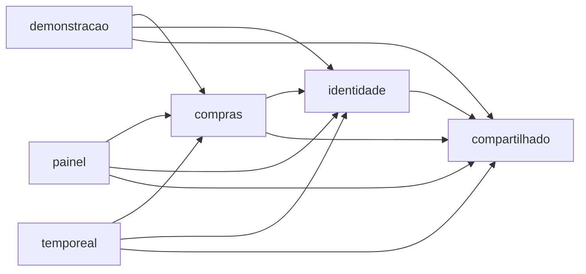
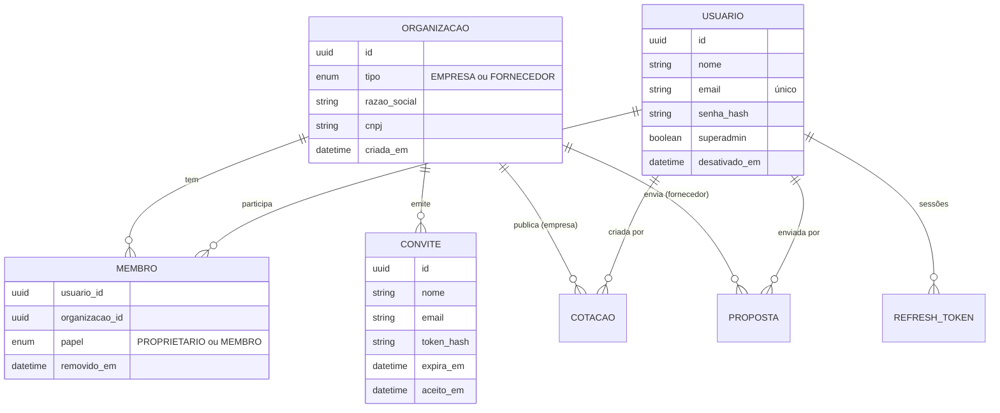

# 001 · Plano técnico

Como a [spec 001](spec.md) vira código. As decisões estruturais ganham ADR no passo em que forem implementadas.

## Ordem e por quê

1. **Módulos primeiro**, sem mudar comportamento. É uma mudança só de lugar, protegida pelos testes que já existem, e todo o resto já nasce no módulo certo.
2. **Rastreio e logs** logo em seguida: é barato e ajuda a diagnosticar a migração de identidade em produção.
3. **Pessoas e organizações**, a mudança mais profunda, com migração de dados.
4. **Autorização por organização**, que depende do passo anterior.
5. **Equipe** e **superadmin**, que usam o novo modelo.
6. **Padrões de API** e **política de dados**.
7. **Limpeza**: as tabelas antigas só saem depois que a versão nova estiver validada em produção.

## Módulos (R5)

O back-end vira um **monólito modular**: um único deploy, com módulos de negócio de fronteiras explícitas. Dentro de cada módulo, as camadas da **Clean Architecture**. O detalhamento e as alternativas estão no [ADR 0013](../../adr/0013-monolito-modular-com-clean-architecture.md).



| Módulo | Responsabilidade |
|---|---|
| `identidade` | Contas, login, sessões e segurança; organizações, equipe e superadmin nos próximos passos |
| `compras` | Cotações, propostas, negociações e mensagens |
| `painel` | Números dos dashboards: só leitura, consultas próprias (o primeiro passo de CQRS, no mesmo banco) |
| `temporeal` | WebSocket: reage aos eventos de `compras` |
| `demonstracao` | Contas e dados da demo pública |
| `compartilhado` | Exceções de negócio, validação de documentos e configuração web comum |

**Por que cotação, proposta e negociação ficaram juntas:** separadas, criavam dependência circular, e o motivo é de negócio. Abrir uma negociação aceita a proposta e muda a cotação na mesma transação; fechar o negócio encerra a cotação e recusa as outras propostas. São partes do mesmo contexto.

Camadas de cada módulo:

```text
modulo/
├── dominio/          entidades, status, eventos (não conhece as camadas de fora)
├── aplicacao/        casos de uso e mapeadores
│   ├── dto/          entradas e saídas
│   └── porta/        interfaces para o que é externo (persistência, token, senha, canal)
└── infraestrutura/   adaptadores: web (REST), persistencia (Spring Data/JDBC), seguranca
```

Regras, todas verificadas em `ArquiteturaTest`:

- **Entre módulos (Spring Modulith):** sem ciclos, e um módulo só usa o que o outro expõe como interface nomeada (`dominio`, `aplicacao`, `dto` e, na identidade, `seguranca`). Portas e infraestrutura são privadas.
- **Entre camadas (ArchUnit):** o domínio não depende de aplicação nem de infraestrutura; domínio e aplicação não conhecem web, Spring Data, Spring Security nem mensageria.
- **Concessão consciente:** as entidades levam anotações do JPA, e as associações entre módulos (cotação → empresa) continuam. Separar modelo de domínio e de persistência fica para quando um módulo precisar de outro banco.

## Rastreio e logs (R6)

- **Micrometer Tracing** (ponte OpenTelemetry) gera um `traceId` por requisição e o coloca no MDC: todo log da requisição o carrega.
- Um filtro devolve o `traceId` no cabeçalho `X-Trace-Id`, e as respostas de erro também o trazem.
- **Logs estruturados em JSON** (suporte nativo do Spring Boot) no perfil de produção. Em desenvolvimento, texto legível.
- Exportar *traces* para um coletor fica desligado por padrão e pode ser ligado só com configuração. Será usado na fase de IA.
- **Logs não vazam dados:** um teste executa os fluxos de cadastro, login e negociação, captura a saída e falha se encontrar senha, token, e-mail completo ou o texto de uma mensagem.

ADR: **0014 · Rastreio por requisição e logs estruturados**.

## Pessoas e organizações (R1)



- **CNPJ único por tipo** (`cnpj`, `tipo`): reproduz a regra de hoje, em que a mesma empresa pode comprar e também fornecer.
- **E-mail único entre todos os usuários**, como hoje entre empresas e fornecedores.
- As colunas `empresa_id` e `fornecedor_id` das tabelas de negócio **mantêm o nome** e passam a apontar para `tb_organizacao`. Cotação ganha `criada_por` e proposta ganha `enviada_por`. Em mensagem, `remetente_id` passa a ser a pessoa.
- Membro removido não é apagado (`removido_em`): o que ele fez continua com o nome dele.

### Migração dos dados (Flyway V3)

1. Cria `tb_organizacao`, `tb_usuario`, `tb_membro` e `tb_convite`.
2. Copia empresas e fornecedores para `tb_organizacao` **mantendo os ids**.
3. Cria um usuário proprietário para cada uma, **com o mesmo id da organização**, o mesmo e-mail e o mesmo hash de senha. O nome da pessoa começa igual ao da organização e pode ser editado. Como `remetente_id` das mensagens e `usuario_id` das sessões já guardavam esse id, nada precisa ser convertido.
4. Aponta as chaves estrangeiras para `tb_organizacao` e preenche `criada_por` e `enviada_por` com o proprietário.
5. Apaga as sessões abertas: todos entram de novo, já com o token novo.

O SQL precisa rodar no PostgreSQL e no H2 em modo PostgreSQL. O `MigracoesPostgresTest` valida no banco real, e um teste novo confere os dados migrados. As tabelas antigas (`tb_empresa`, `tb_fornecedor`, `tb_perfil`) só são removidas numa V4, no último passo.

### Token e sessão

Claims do access token: `sub` (pessoa), `org` (organização), `tipo` (`EMPRESA` | `FORNECEDOR`, o mesmo nome de hoje) e `papel` (`PROPRIETARIO` | `MEMBRO` | `SUPERADMIN`). Nenhum dado pessoal.

As autoridades do Spring vêm daí: `ROLE_EMPRESA` ou `ROLE_FORNECEDOR`, que mantêm os `@PreAuthorize` atuais, mais `ROLE_PROPRIETARIO` ou `ROLE_SUPERADMIN`. A identidade do WebSocket segue o mesmo token, e a fila pessoal de avisos passa a ser por pessoa.

ADR: **0015 · Pessoas e organizações separadas**.

## Autorização por organização (R4)

- A posse passa a ser **da organização**: o recurso pertence à organização do token, e qualquer membro ativo opera conforme o papel. A verificação continua no service, perto da regra (o princípio do ADR 0005 se mantém).
- Cada módulo tem uma política de acesso única (ex.: `AcessoNegociacao.visivelPara(id, usuario)`), usada por todos os pontos de entrada: REST, WebSocket e o que vier depois, inclusive as ferramentas de IA.
- Recurso de outra organização gera **404**, com a mesma resposta de um id inexistente.
- **Trava de rota nova:** um teste lista as rotas do Spring MVC que recebem id e roda, para cada uma, "outra organização tenta acessar → 404". Se uma rota não tiver caso de teste cadastrado, o teste falha.

ADR: **0016 · Autorização por organização** (substitui o ADR 0005).

## Equipe (R2)

- O convite gera um token aleatório. O banco guarda só o hash, como no refresh token, e o link `/convite/{token}` vale 72 horas e uma vez.
- Aceitar o convite cria o usuário, o vínculo de membro e a sessão, numa transação só.
- Remover um membro marca `removido_em` e revoga as sessões dele. O access token em uso vence em até 15 minutos, e o WebSocket dele é desconectado.
- A organização sempre tem ao menos um proprietário ativo.

## Superadmin (R3)

- Criado na subida do servidor a partir de variáveis de ambiente (e-mail e senha). Sem elas, não existe. Se a senha da variável mudar, o hash é atualizado.
- Não pertence a nenhuma organização. Só acessa `/api/v1/admin/**`, que nesta fase é somente leitura (organizações com totais).
- No front-end, a área administrativa tem navegação própria. O console completo de auditoria vem na fase 5.

## Padrões de API (R7)

- **Paginação** com `Pageable` do Spring Data: padrão de 20 itens, máximo de 50, e uma lista de campos aceitos para ordenação por endpoint. A resposta usa o formato estável do Spring Data (`content` + `page`). No front-end, as listas ganham "Carregar mais".
- **Problem Details (RFC 9457)** com o `ProblemDetail` do Spring: `title`, `status`, `detail`, `instance`, mais `traceId` e `erros` (por campo). O front-end passa a ler `detail`.

ADR: **0017 · Paginação e Problem Details**.

## Política de dados (R8)

O documento `docs/dados.md` classifica os dados:

| Classe | Exemplos |
|---|---|
| Credenciais | hash de senha, tokens |
| Pessoais | nome, e-mail |
| Empresariais públicos | razão social, CNPJ |
| Comerciais sigilosos | valores, condições, mensagens da negociação |

Para cada classe, ele diz o que pode ir para logs, auditoria, IA e dados de demonstração, e por quanto tempo é guardado. As fases 5 e 7 seguem esse documento.

## Front-end

- **Cadastro:** dados da organização e "Seu nome".
- **Menu da conta:** pessoa, organização e papel.
- **Equipe** (proprietário): convidar, copiar link, listar e remover membros.
- **Aceitar convite:** tela pública para definir a senha.
- **Mensagens:** mostram a pessoa e a organização.
- **Área administrativa** para o superadmin.
- Paginação nas listas e erros no formato novo.
- **Demo:** cada conta de demonstração ganha uma segunda pessoa na equipe.

## Riscos

| Risco | Como tratar |
|---|---|
| Migração de identidade quebra dados em produção | Ids preservados, teste da migração no PostgreSQL, cópia do banco antes do deploy e tabelas antigas mantidas até a validação |
| Spring Modulith ainda sem suporte ao Boot 4 | Conferir no passo 2. Se faltar, ArchUnit com as mesmas regras |
| Muitas mudanças no front-end ao mesmo tempo | Um passo por vez, com os testes ponta a ponta cobrindo cada fluxo |
| Isolamento esquecido numa rota futura | A trava de rota nova no teste |
