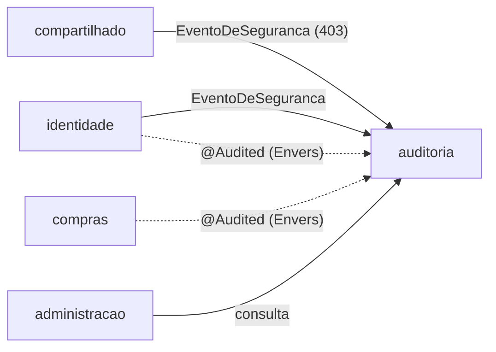

# 003 · Plano técnico

Como a [spec 003](spec.md) vira código. As decisões estruturais ganham ADR no passo em que forem implementadas.

## Ordem e por quê

1. **Histórico de alterações** primeiro: é a base da atividade do proprietário e do console, e quanto antes ligar, mais história existe quando as telas chegarem.
2. **Eventos de segurança**, que não dependem do histórico.
3. **Só acréscimo e retenção**, com os dois tipos de registro já gravando.
4. **Atividade do proprietário**, a primeira tela, sobre o histórico.
5. **Console do superadmin**, que reaproveita a atividade e soma os eventos.
6. **Consumo de IA** e **exclusão a pedido**, que são independentes.

## Módulo `auditoria`

Um módulo novo, como `painel` e `administracao`. Ele **ouve** os outros e **lê** o histórico; ninguém depende dele para trabalhar.

- `aplicacao`: os casos de uso de consulta (atividade, eventos, histórico, consumo) e as portas.
- `infraestrutura`: o ouvinte dos eventos, os adaptadores do Envers e do JPA, a rotina de retenção e os controllers.

## Histórico de alterações (R1): Hibernate Envers

- `@Audited` nas entidades de `Organizacao`, `Usuario`, `Membro`, `Convite`, `Cotacao`, `Proposta` e `Negociacao`. `@NotAudited` em `senhaHash`, `tokenHash` e nas coleções que apontam para entidades fora do histórico (as mensagens).
- **Uma revisão por transação**, numa entidade própria (`tb_revisao`): número, momento, pessoa, organização da pessoa, identificador de rastreio e origem (`PESSOA` ou `SISTEMA`). Um `RevisionListener` preenche os dados a partir do usuário autenticado; sem usuário (reset da demo, rotinas agendadas), a origem é `SISTEMA`.
- `track_entities_changed_in_revision` liga a lista de entidades mudadas em cada revisão, e `global_with_modified_flag` marca quais campos mudaram. Com isso, a atividade sai de uma consulta por revisão, sem comparar versões inteiras.
- As tabelas `_aud` e a de revisão nascem por **migração Flyway (V6)**, como todo o resto do esquema: o Hibernate continua só validando.
- A anotação do Envers no domínio é aceitável pela regra de camadas, como já são as do JPA.
- As marcas de leitura da negociação (`lida_empresa_em`, `lida_fornecedor_em`) ficam fora: mudam a cada visita e não são uma decisão de ninguém.
- A origem da revisão é `PESSOA` (autenticada), `PUBLICO` (cadastro e aceite de convite, sem login) ou `SISTEMA` (rotinas, fora de uma requisição).

ADR: **0021 · Auditoria com Hibernate Envers e eventos de segurança em tabela própria**.

## Eventos de segurança (R2)

- Um evento de domínio no módulo compartilhado, `EventoDeSeguranca(tipo, usuarioId, organizacaoId, emailMascarado, detalhe)`, publicado por quem sabe que algo aconteceu: o login e a renovação de sessão, a equipe, o superadmin da configuração e as respostas 403.
- O módulo `auditoria` ouve o evento e grava em `tb_evento_seguranca` numa **transação própria** (`REQUIRES_NEW`). Assim, a senha errada fica registrada mesmo com o login desfeito.
- Se a gravação falhar, a ação principal segue e a falha vai para o log com o rastreio. Derrubar um login porque a auditoria caiu tiraria o portal do ar por um problema secundário.
- Tipos: `LOGIN`, `LOGIN_FALHOU`, `LOGIN_BLOQUEADO`, `SESSAO_REVOGADA_POR_REUSO`, `LOGOUT`, `CONVITE_CRIADO`, `CONVITE_CANCELADO`, `CONVITE_ACEITO`, `MEMBRO_REMOVIDO`, `SUPERADMIN_CRIADO`, `SUPERADMIN_SENHA_TROCADA`, `SUPERADMIN_DESATIVADO`, `ACESSO_NEGADO`, `CONSULTA_DE_AUDITORIA`, `DADOS_PESSOAIS_ANONIMIZADOS`, e, com a spec 004, `REDEFINICAO_DE_SENHA_PEDIDA` e `SENHA_REDEFINIDA`.

## Só acréscimo e retenção (R3)

- Nenhuma porta de escrita da auditoria tem método de alterar ou apagar.
- **No PostgreSQL, um gatilho** recusa `UPDATE` e `DELETE` nas tabelas de auditoria, a menos que a transação tenha declarado que é manutenção (`SET LOCAL` de uma variável própria). Só três rotinas fazem isso: a retenção, o reset da demo e a anonimização. É uma proteção contra erro da aplicação, não contra quem administra o banco, e a spec diz isso.
- O gatilho fica numa pasta de migração só do PostgreSQL (`db/vendor/postgresql`, pelo `{vendor}` do Flyway). Os testes em H2 não têm o gatilho; um teste no PostgreSQL real (Testcontainers) confere que ele recusa.
- **Retenção:** rotina diária apaga o que passou de 5 anos (revisões, versões e eventos).
- **Demo:** o reset apaga a auditoria das organizações de exemplo junto com elas. Os eventos do superadmin ficam.

## Atividade do proprietário (R4)

- `GET /api/v1/equipe/atividade` (só proprietário), paginada, com filtros `pessoa`, `de` e `ate`.
- Pagina sobre as revisões da organização (`tb_revisao.organizacao_id`). Cada revisão vira um item: quem, quando e as mudanças de cada entidade daquela transação.
- **Tradução para linguagem de negócio** por entidade, com a lista de campos que podem aparecer e o rótulo de cada um (`dataLimite` → "prazo"). Campo fora da lista não aparece, nem se mudar. Valores formatados como na tela (moeda, data).
- Só ações de pessoas da organização: a revisão é da organização de quem agiu.
- Na tela **Equipe**, o proprietário ganha a aba **Atividade**, ao lado de **Pessoas**: linha do tempo agrupada por dia, com a pessoa, a frase da ação, o registro (com link) e o antes e depois.

## Console do superadmin (R5)

| Rota | O que devolve |
|---|---|
| `GET /api/v1/admin/auditoria/eventos` | Eventos de segurança, com filtros `tipo`, `organizacao`, `de` e `ate`, paginados |
| `GET /api/v1/admin/organizacoes/{id}/atividade` | A atividade da organização, igual à do proprietário |
| `GET /api/v1/admin/auditoria/historico/{entidade}/{id}` | Todas as versões de um registro, com autor e momento |

- Cada consulta à atividade, aos eventos ou ao histórico de uma organização gera um `CONSULTA_DE_AUDITORIA`.
- Na trava de rota nova (spec 001, R4), as rotas `/admin/**` entram como **exceção declarada**: para elas, a garantia é o 403 a qualquer pessoa de organização, e um teste confere.
- No front-end, a navegação do superadmin ganha **Segurança** e **Consumo de IA**, além de **Organizações**. Cada organização abre uma tela com a atividade e os eventos dela.

## Consumo de IA (R6)

- `tb_consumo_ia`: organização, pessoa, funcionalidade, modelo, tokens de entrada e de saída, custo estimado (em centavos de dólar), latência, resultado, rastreio e momento.
- Uma porta `RegistroDeConsumoDeIa` no módulo `auditoria`, que a fase 7 vai usar. Nesta fase, um teste grava uma chamada de exemplo.
- `GET /api/v1/admin/consumo-ia` com totais por organização ou por funcionalidade, num período.

## Exclusão a pedido (R7)

- Caso de uso do superadmin, atrás de confirmação: troca nome e e-mail da pessoa por um marcador ("Pessoa removida #a1b2"), na conta e nas versões dela no histórico, numa transação de manutenção.
- Recusado se a pessoa for a única proprietária ativa da organização.
- É a primeira ação de escrita do console; fica no último passo.

## Front-end

- **Equipe** do proprietário: abas **Pessoas** e **Atividade**.
- **Superadmin**: **Organizações** (com a tela de cada uma), **Segurança** e **Consumo de IA**.
- Listas com a `ListaPaginada` e o "Carregar mais", e o visual atual (listas agrupadas, datas no formato brasileiro, estados vazios).

## Riscos

| Risco | Como tratar |
|---|---|
| Esquema das tabelas do Envers diferente do que o Hibernate espera | A migração V6 escrita a partir do esquema que o próprio Envers gera num teste, e o `ddl-auto=validate` em todos os testes |
| A auditoria deixar as ações lentas | Envers grava na mesma transação, sem consultas extras; índices por organização, pessoa e momento; medir no teste de fumaça |
| Ruído na atividade (campos técnicos, reset da demo) | Lista de campos permitidos por entidade e origem `SISTEMA` fora da atividade do proprietário |
| Vazar um dado sensível para a auditoria | Campos classificados na política de dados antes de entrar, `@NotAudited` nas credenciais e teste que procura hash e token nas tabelas de auditoria |
| Crescimento das tabelas | Retenção de 5 anos e paginação; volume pequeno para o porte atual |
